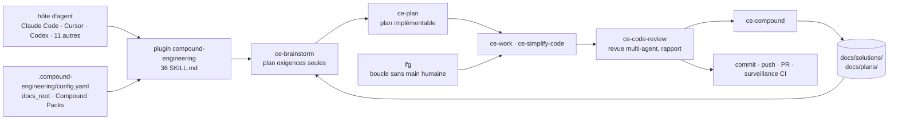

# EveryInc/compound-engineering-plugin

> **Trente-six compétences qui imposent une boucle idée-plan-code-revue-mémoire à un agent de codage.**

## Le problème

Une session d'agent de codage démarre à zéro à chaque fois : les contraintes découvertes la
semaine dernière, les pièges d'un fichier, les règles maison sont réappris ou réoubliés. Le
travail s'accumule en dette plutôt qu'en levier, et chaque changement suivant coûte plus cher
que le précédent.

## Ce que ça fait vraiment

Compound Engineering est un *plugin* de 36 compétences (*skills*) pour agents de codage, pas un
programme qui tourne seul. Ce qu'il apporte lui-même, ce sont des invites structurées :

- **Une boucle en six temps**, chacune une compétence : `/ce-brainstorm` (questions-réponses
  pour écrire un plan « exigences seules »), `/ce-plan` (l'enrichir jusqu'à être implémentable),
  `/ce-work` (l'exécuter), `/ce-simplify-code`, `/ce-code-review` (revue multi-agent en
  lecture seule, l'application locale des correctifs restant explicite), `/ce-compound`.
- **`/ce-compound` écrit ce qui a été appris dans `docs/solutions/`**, que le `/ce-brainstorm`
  et le `/ce-plan` suivants relisent comme matière. C'est le seul mécanisme de mémoire du lot,
  et il tient dans des fichiers du dépôt.
- **`/lfg`** enchaîne toute la chaîne sans main humaine : route vers un plan ou un correctif
  `ce-debug`, travaille, simplifie, applique la revue, teste au navigateur, commite ; s'il y a
  un remote, pousse, ouvre une PR et surveille la CI avec une boucle de réparation bornée. Il
  ne fusionne pas sans autorisation et peut s'arrêter avec des restes.
- **Le reste du catalogue** couvre le git (`ce-commit-push-pr`, `ce-babysit-pr`, `ce-worktree`),
  la demande ponctuelle (`ce-debug`, `ce-explain`, `ce-pov`, `ce-bakeoff`), les tests
  (`ce-test-browser`, `ce-test-xcode`) et l'outillage (`ce-setup`, `wtf`, `ce-noslop`).
- **Les *Compound Packs*** (annoncés expérimentaux) permettent de déclarer des dossiers de
  règles prescriptives, locaux ou dépôts git épinglés, que la planification cite et que la
  revue fait respecter — pour partager la connaissance entre dépôts d'une organisation.
- **Quatorze hôtes d'agents** sont pris en charge : Claude Code, Cursor, Codex (app et CLI),
  Kimi Code, Cline, Grok, Devin, Copilot, Factory Droid, Qwen Code, OpenCode, Pi, omp,
  Antigravity CLI. La syntaxe d'invocation change selon l'hôte (`/nom`, `$nom`, `/skill:<nom>`).

## Comment c'est branché

Aucun diagramme tiré du code n'existe pour ce dépôt ; ce schéma reprend la boucle décrite dans
le README et ses artefacts de fichiers (`docs/solutions/`, `docs/plans/`,
`.compound-engineering/config.yaml`).



## Essayer

Le README donne une commande par hôte ; voici celles de Claude Code, Cursor et Codex CLI,
suivies de la mise en route dans un projet.

```bash
# Claude Code (dans la session)
/plugin marketplace add EveryInc/compound-engineering-plugin
/plugin install compound-engineering

# Cursor (dans le chat Agent)
/add-plugin compound-engineering

# Codex CLI (shell)
codex plugin marketplace add EveryInc/compound-engineering-plugin
codex plugin add compound-engineering@compound-engineering-plugin

# puis, dans n'importe quel projet
/ce-setup
/ce-brainstorm make background job retries safer
/ce-plan
/ce-work
/ce-simplify-code
/ce-code-review
/ce-compound
```

## Coût et pièges

- **Le plugin est gratuit (MIT), l'agent ne l'est pas.** Il n'exécute rien : il faut un hôte —
  Claude Code, Cursor, Codex, Copilot… — avec l'abonnement ou la facturation de jetons qui va
  avec. Le README ne chiffre aucun coût, mais une boucle à six compétences plus une revue
  multi-agent consomme nettement plus de jetons qu'une invite unique.
- **Compte tiers à créer selon l'hôte** : le README précise par exemple que Grok Bot n'a pas de
  connexion propre et s'appuie sur le compte Cursor.
- **La mise à jour est un piège documenté** : rafraîchir le *marketplace* **avant** de mettre à
  jour ; `/plugin update` seul laisse sur l'ancienne version (voir `docs/install/upgrading.md`).
- **Artefacts dans le dépôt** : les compétences écrivent dans `docs/solutions/` et
  `docs/plans/` par défaut ; si `docs/` est du contenu suivi, il faut déplacer la racine des
  artefacts via le réglage `docs_root`.
- **Prise en charge inégale** : sur Devin, des compétences déclarent des `allowed-tools` de
  style Claude non reconnus (`Bash`), et demandent alors une permission au lieu de s'exécuter.
  Les *Compound Packs* sont annoncés expérimentaux. Sous omp, les compétences masquées ou
  manuelles exigent la forme `/skill:<nom>`.

## Ce que ce n'est pas

- **Ce n'est pas un agent ni un modèle.** Aucun code d'exécution : ce sont des fichiers
  `SKILL.md` chargés par un hôte existant. Sans hôte, le dépôt ne fait rien.
- **Ce n'est pas une mémoire partagée automatique.** La « compounding » repose sur des fichiers
  markdown écrits dans le dépôt par `/ce-compound` et relus par les compétences suivantes : pas
  de base vectorielle, pas de service, et rien ne se propage entre dépôts sans déclarer un pack.
- **Ce n'est pas neutre.** Le README l'assume : projet opiniâtre, direction tenue par deux
  mainteneurs d'Every, toutes les contributions ne seront pas acceptées. On adopte une méthode
  de travail complète, pas une boîte à outils dans laquelle piocher sans y penser.

## Alternatives

| | Quand le préférer |
|---|---|
| **addyosmani/agent-skills** | Autre collection de compétences pour agents de codage. À préférer pour piocher des compétences indépendantes une par une, quand on ne veut pas adopter une boucle de travail imposée de bout en bout. |
| **ComposioHQ/awesome-claude-skills** | Liste annotée, pas un plugin installable : sert à repérer quelles compétences existent avant de choisir ce qu'on installe, y compris celle-ci. |
| **bytedance/deer-flow, langgenius/dify** | Hors sujet ici : ce sont des plateformes d'orchestration d'agents applicatifs, pas des extensions de l'agent qui écrit ton code. Le rapprochement du catalogue vient du vocabulaire « agent », pas de l'usage. |

## Pour toi

Si ton travail data/IA passe déjà par un agent de codage, c'est l'un des rares dispositifs qui
adresse le vrai point faible — la perte de contexte entre sessions — avec un mécanisme lisible
(des fichiers markdown dans le dépôt) plutôt qu'une boîte noire. À adopter en commençant par
`/ce-brainstorm`, `/ce-plan` et `/ce-compound` seuls, avant d'envisager `/lfg` et sa facture en
jetons ; le reste du catalogue s'ajoute quand la boucle courte a fait ses preuves.
