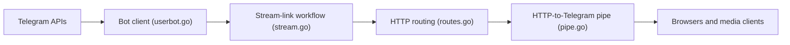

# EverythingSuckz/TG-FileStreamBot

> Bot Telegram qui génère des liens de téléchargement directs pour les fichiers envoyés, pour qui héberge ses propres liens.

## Le problème
Les fichiers stockés sur Telegram n'ont pas d'URL HTTP directe pour un navigateur ou un lecteur média.

## Ce que ça fait vraiment
README très court (moins de 800 caractères, sans instructions). D'après le code : service Go qui combine un bot Telegram, une session utilisateur Telegram et un serveur HTTP ; un message reçu produit un lien avec identifiant haché, et le serveur relaie les octets depuis Telegram. Configuration par variables d'environnement, cache, login QR. Docker et Procfile fournis.

## Comment c'est branché

## Essayer
Aucune commande documentée dans le README ; renvoi vers un site de documentation externe.

## Coût et pièges
Gratuit, mais il faut un bot Telegram, des identifiants API Telegram et un hébergement. L'usage relève des conditions de Telegram, à vérifier.

## Ce que ce n'est pas
Pas un service de stockage : Telegram reste la source. Licence AGPL-3.0 : tout fork exposé en réseau doit rester ouvert.

## Alternatives
Teldrive est cité en crédits (projet voisin), sans comparaison.

## Pour toi
À ignorer : outil de contournement de liens sans rapport avec la donnée ou l'IA, README insuffisant pour évaluer.

