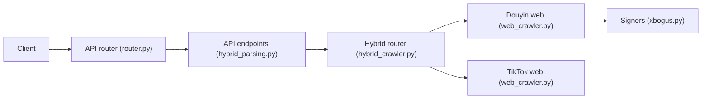

# Evil0ctal/Douyin_TikTok_Download_API

> API auto-hébergée de collecte de données et de téléchargement pour Douyin et TikTok.

## Le problème
Douyin et TikTok n'offrent pas d'accès simple à leurs données : signatures anti-bot, cookies qui expirent, endpoints qui changent sans prévenir.

## Ce que ça fait vraiment
La v5 récupère posts, auteurs, commentaires, recherches et télécharge vidéos sans filigrane (flux propre déjà publié).
Un navigateur headless génère des identités invitées ; un ordonnanceur les fait tourner avec token buckets et coupe-circuits par endpoint.
Signatures a_bogus, X-Bogus, X-Gnarly, X-Dynosaur en Python ; archivage PostgreSQL/TimescaleDB + Redis.
Accès par REST (93 opérations), MCP, CLI `dtk` et console React.

## Comment c'est branché

Attention : ce schéma suit l'architecture fournie, qui décrit la v4 ; la v5 du README est une réécriture.

## Essayer
```bash
git clone https://github.com/Evil0ctal/Douyin_TikTok_Download_API.git
cd Douyin_TikTok_Download_API
docker compose -p dtk -f docker/compose.yml up -d
docker compose -p dtk -f docker/compose.yml logs api
```

## Coût et pièges
Gratuit, mais il faut Postgres avec TimescaleDB, Redis et un conteneur navigateur. L'image navigateur n'est pas publiée : build local obligatoire.

## Ce que ce n'est pas
Pas une API officielle : tout repose sur la rétro-ingénierie et peut casser à chaque changement des plateformes. Le respect des CGU et du droit est à ta charge.

## Alternatives
Aucune alternative nommée ; la v4 reste disponible sur une branche.

## Pour toi
À ignorer sauf besoin précis de données TikTok : le risque juridique et la fragilité face aux changements des plateformes pèsent plus que le gain pour un profil data généraliste.
