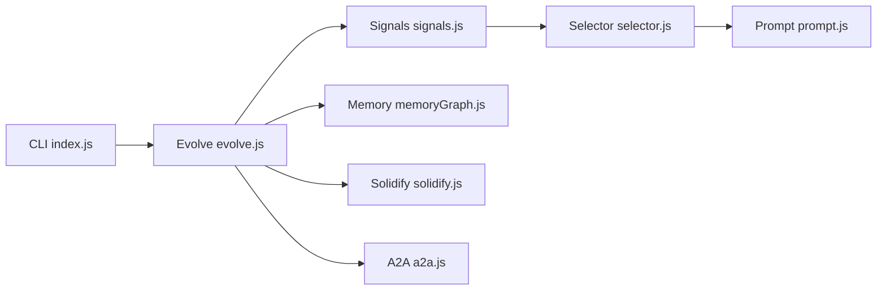

# EvoMap/evolver

> CLI Node.js qui transforme les logs d'un agent en prompts d'évolution auditables (protocole GEP).

## Le problème
Améliorer un agent se fait par retouches de prompts au coup par coup, sans trace ni réutilisation des correctifs.

## Ce que ça fait vraiment
Dans un dépôt git, `evolver` lit `./memory/` (logs, erreurs, signaux), choisit un « Gene » ou « Capsule » dans un magasin local, émet un prompt GEP sur stdout et enregistre un `EvolutionEvent`. Il n'édite pas le code : seul `solidify.js` exécute des commandes de validation filtrées (`node`, `npm`, `npx`). Hooks pour Cursor, Claude Code, Codex, Kiro, opencode ; hub EvoMap optionnel (skills, pool de workers, validation).

## Comment c'est branché


## Essayer
```bash
npm install -g @evomap/evolver
evolver
evolver --review
evolver --loop
evolver setup-hooks --platform=claude-code
```

## Coût et pièges
Gratuit hors ligne. Avec le hub, le rôle de validateur est actif par défaut et le signalement automatique d'issues GitHub est activé si un token est présent.

## Ce que ce n'est pas
Pas un patcheur de code autonome : il produit du texte qu'un runtime hôte (OpenClaw) interprète. Le projet annonce passer à un modèle « source-available ».

## Alternatives
Aucune alternative nommée ; Hermes Agent est cité uniquement pour une accusation de similarité.

## Pour toi
À surveiller : l'idée de capitaliser les correctifs d'agents en « gènes » auditables est intéressante, mais le passage annoncé au source-available, la GPL et les fonctions réseau actives par défaut freinent l'adoption.
