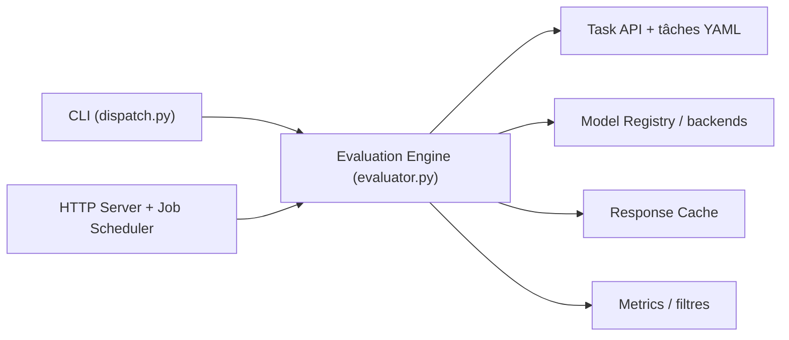

# EvolvingLMMs-Lab/lmms-eval

> Boîte à outils d'évaluation unifiée de modèles multimodaux (image, vidéo, audio) sur plus de 100 tâches.

## Le problème
Les évaluations multimodales sont éparpillées : jeux de données, post-traitements et scores à un seul chiffre qui masquent le bruit.

## Ce que ça fait vraiment
Une CLI (`python -m lmms_eval`) charge un modèle (30+ familles, ou tout endpoint compatible OpenAI, vLLM, SGLang) et des tâches définies en YAML, exécute l'inférence, applique des filtres et métriques, et journalise les résultats. Elle ajoute un cache de réponses, des intervalles de confiance et tests appariés, un serveur HTTP d'évaluation avec file de jobs, une interface web et un serveur MCP.

## Comment c'est branché


## Essayer
```bash
git clone https://github.com/EvolvingLMMs-Lab/lmms-eval.git
cd lmms-eval && uv pip install -e ".[all]"
python -m lmms_eval \
  --model qwen2_5_vl \
  --model_args pretrained=Qwen/Qwen2.5-VL-3B-Instruct \
  --tasks mme \
  --batch_size 1 \
  --limit 8
```

## Coût et pièges
GPU pour les modèles locaux, clés d'API pour les modèles hébergés. Le serveur HTTP est prévu pour des environnements de confiance seulement, sans authentification. La licence est à vérifier.

## Ce que ce n'est pas
Pas un banc de test de modèles texte seuls. Le câblage audio et vidéo n'a pas été relu dans le code par le diagramme.

## Alternatives
Aucune alternative nommée dans le README.

## Pour toi
À adopter si tu évalues des modèles multimodaux : pipeline reproductible avec statistiques, et `--limit 8` permet de tester avant tout gros calcul.
