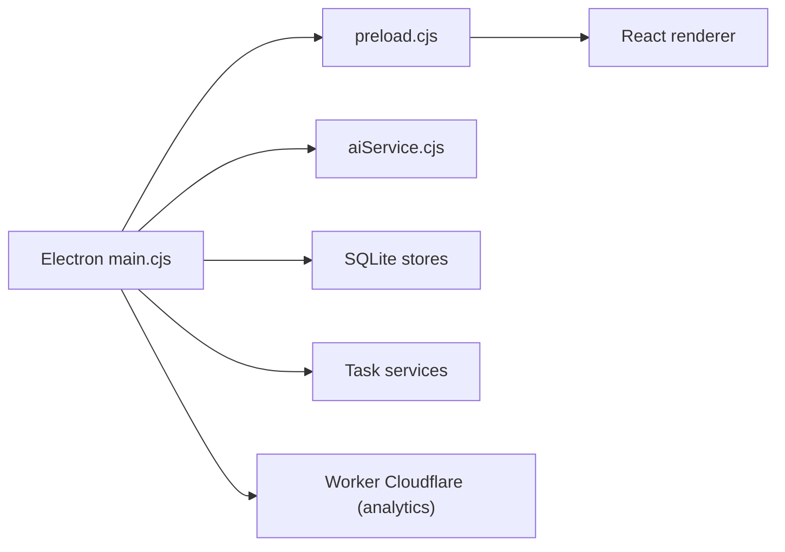

# FB208/OpenBidKit_Yibiao

> Application de bureau (README en chinois) qui aide à rédiger des dossiers d'appel d'offres avec un LLM.

## Le problème
Les outils payants de rédaction de réponses à appels d'offres coûtent cher pour les petites entreprises chinoises.

## Ce que ça fait vraiment
Client Electron (React, SQLite local) : analyse du dossier d'appel d'offres, plan, rédaction du plan technique, base de connaissances d'entreprise, contrôle de doublons, détection de motifs de rejet, export Word. Accepte toute API compatible OpenAI, Ollama ou LM Studio. L'auteur cite 11 000 mots pour 2,19 M de tokens (1,03 ¥). Un service Cloudflare Worker fournit annonces, ressources, licences et statistiques.

## Comment c'est branché


## Essayer
```powershell
cd client
npm ci
npm run dev
npm run dist:win
```

## Coût et pièges
Clé d'un fournisseur de LLM à ta charge ; Node.js 22 et .NET 10 pour compiler. Le README contient des publicités de sponsors et des chiffres d'usage. L'AGPL-3.0 impose l'ouverture des versions modifiées, même en service réseau. Le service en ligne collecte des statistiques d'usage.

## Ce que ce n'est pas
Pas un outil international : ciblé Windows et le marché chinois, avec une archive de l'ancienne version web (FastAPI) conservée.

## Alternatives
Non documenté dans le README.

## Pour toi
Ignorer : domaine (appels d'offres chinois), langue et licence AGPL hors de ton contexte.
