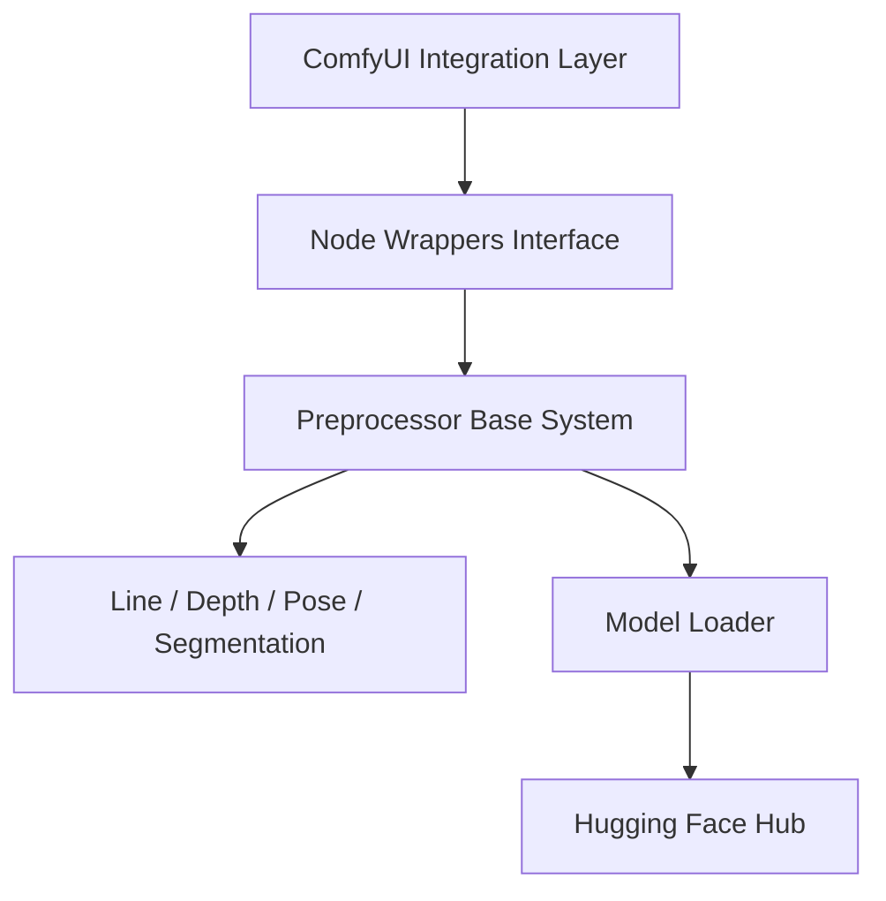

# Fannovel16/comfyui_controlnet_aux

> Jeu de nœuds ComfyUI qui produit les images-guides (contours, profondeur, pose) pour ControlNet.

## Le problème
ControlNet exige des images de conditionnement (contours, cartes de profondeur, squelettes) que l'on fabrique sinon avec des outils disparates.

## Ce que ça fait vraiment
Regroupe les annotateurs de lllyasviel en nœuds ComfyUI : lignes (Canny, HED, Lineart…), profondeur et normales (MiDaS, Depth Anything, Zoe…), poses (OpenPose, DWPose, animaux), segmentation (OneFormer, UniFormer, SAM), recoloration. Un nœud « AIO Aux Preprocessor » les rassemble. Les poids sont récupérés sur le Hub Hugging Face.

## Comment c'est branché


## Essayer
```bash
cd /ComfyUI/custom_nodes/
git clone https://github.com/Fannovel16/comfyui_controlnet_aux/
cd comfyui_controlnet_aux
pip install -r requirements.txt
```

## Coût et pièges
DWPose/AnimalPose tournent sur CPU par défaut ; l'accélération passe par TorchScript ou ONNXRuntime (CUDA 11.8 pour NVidia sauf compilation). Téléchargement de nombreux poids au premier usage.

## Ce que ce n'est pas
Ne fait que des images-guides, pas de génération ni d'inpainting hors nœud dédié. Le code est copié des annotateurs de lllyasviel.

## Alternatives
- ComfyUI Manager : méthode d'installation recommandée.
- sd-webui-controlnet : équivalent côté WebUI, mappé dans les tableaux du README.

## Pour toi
À adopter si tu fais de la génération d'images pilotée par ControlNet dans ComfyUI : le catalogue de préprocesseurs est complet, à surveiller côté mainteneur unique.

