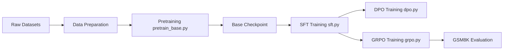

# FareedKhan-dev/train-llm-from-scratch

> Tutoriel exécutable qui entraîne un petit LLM en PyTorch pur, du pré-entraînement à GRPO.

## Le problème
Les tutoriels s'arrêtent souvent au pré-entraînement ou cachent le post-training derrière `trl`/`peft`. Difficile de voir SFT, reward model, PPO, DPO et GRPO sur un même modèle.

## Ce que ça fait vraiment
Un Transformer écrit à la main (`src/models/`), tokenisation `r50k_base` vers HDF5, pré-entraînement (`pretrain_base.py`, DDP, bf16), puis SFT avec masque de perte, reward model Bradley-Terry, DPO/ORPO/KTO, PPO avec GAE et GRPO sur GSM8K. Évaluation par exactitude GSM8K, chat en CLI, panneau Streamlit, configs JSON par étape et variantes `smoke` qui tournent sur CPU.

## Comment c'est branché


## Essayer
```bash
git clone https://github.com/FareedKhan-dev/train-llm-from-scratch.git
cd train-llm-from-scratch
pip install -e .
python scripts/train_transformer.py
python tests/test_post_training_smoke.py
streamlit run ui/app.py
```

## Coût et pièges
GPU nécessaire : un T4 suffit pour 13M paramètres, pas pour le milliard. Les runs du README ont tourné sur 2× L40 ; téléchargement d'un extrait de The Pile.

## Ce que ce n'est pas
Pas une bibliothèque de production ni un modèle utilisable : le modèle de 13M produit du texte à peine cohérent. Le reward model plafonne à 0,574 d'exactitude.

## Alternatives
Aucune alternative nommée dans le README.

## Pour toi
À adopter comme support d'apprentissage : chaque algorithme de post-training est écrit à la main, lisible et testable en quelques secondes grâce aux configs `smoke`, ce qui aide vraiment à comprendre DPO ou GRPO.
