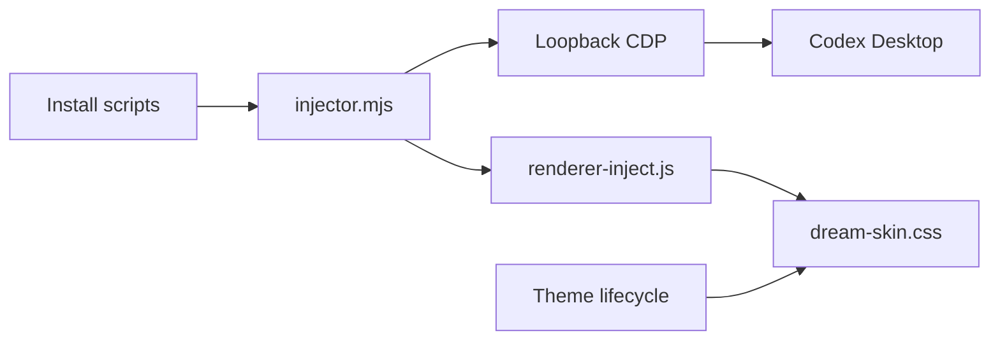

# Fei-Away/Codex-Dream-Skin

> Habille l'application de bureau Codex d'un fond d'écran personnalisé, sans modifier l'application.

## Le problème
Non documenté comme besoin : l'interface Codex de bureau n'est pas personnalisable visuellement.

## Ce que ça fait vraiment
Injecte du CSS et un fond via le protocole de débogage Chrome (CDP) local dans le processus Codex déjà lancé, sans toucher à l'app ni à sa signature. Sous macOS (barre de menus) et Windows (zone de notification) : thèmes enregistrés, import de ZIP validé, restauration en un clic. Non officiel. Un site de galerie propose l'application en un clic.

## Comment c'est branché


## Essayer
```bash
# Pas de commande : installer le .dmg (macOS) ou le Setup.exe (Windows) depuis les Releases.
# Développeurs : macos/ → « Install Codex Dream Skin.command » ; windows/ → scripts/install-dream-skin.ps1
```

## Coût et pièges
Gratuit. Le port CDP écoute en local (127.0.0.1) mais sans authentification : tout autre processus de la machine peut s'y connecter tant que Codex n'est pas redémarré. Paquets non signés (avertissement système). Jeune dépôt (juillet 2026).

## Ce que ce n'est pas
Pas un outil officiel d'OpenAI, ni un gestionnaire de clés ou de fournisseurs.

## Alternatives
Aucune alternative nommée dans le README.

## Pour toi
Esthétique pure, avec une surface d'attaque locale non négligeable : à ignorer.

