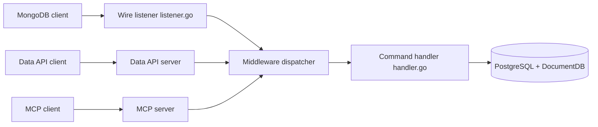

# FerretDB/FerretDB

> Proxy open source qui parle le protocole MongoDB et stocke dans PostgreSQL + DocumentDB.

## Le problème
MongoDB est passé sous licence SSPL, inutilisable pour beaucoup de projets open source ou commerciaux. Or la plupart des usages n'exigent que les fonctions de base d'une base documents.

## Ce que ça fait vraiment
Traduit les requêtes du wire protocol MongoDB 5.0+ en SQL exécuté sur PostgreSQL avec l'extension DocumentDB.
Compatible avec les drivers et outils MongoDB courants (mongosh), avec une liste publiée de différences.
Expose aussi une Data API HTTP et un serveur MCP qui passent par le même dispatcher.
Disponible en image Docker, binaires, paquets Linux et bibliothèque Go embarquable.

## Comment c'est branché


## Essayer
```bash
docker run -d --rm --name ferretdb -p 27017:27017 \
  -e POSTGRES_USER=<username> \
  -e POSTGRES_PASSWORD=<password> \
  ghcr.io/ferretdb/ferretdb-eval:2
docker exec -it ferretdb mongosh
docker stop ferretdb
```

## Coût et pièges
Gratuit en auto-hébergé. L'image « eval » perd les données à l'arrêt : suivre le guide d'installation pour la prod. Un module de télémétrie existe dans le code (`telemetry.go`).

## Ce que ce n'est pas
Pas un MongoDB complet : compatibilité « dans beaucoup de cas », certaines commandes manquent. Pas une base autonome : PostgreSQL + DocumentDB restent à opérer.

## Alternatives
Aucune alternative nommée dans le README (hors offres managées : FerretDB Cloud, Civo, Tembo, Elestio, Cozystack).

## Pour toi
À surveiller : utile si une appli ou un outil ML exige une API Mongo mais que tu veux rester sur PostgreSQL, à valider contre la liste des commandes supportées.
