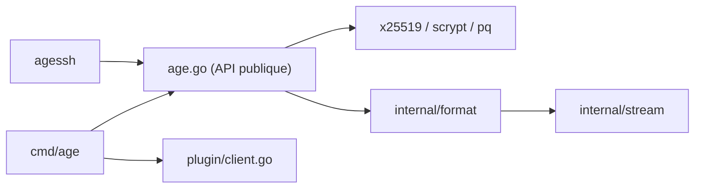

# FiloSottile/age

> Outil, format et bibliothèque Go de chiffrement de fichiers simple, avec clés courtes et support post-quantique.

## Le problème
GPG est complexe et riche en options ; il faut chiffrer un fichier ou une archive sans configuration.

## Ce que ça fait vraiment
`age` chiffre et déchiffre en flux vers un ou plusieurs destinataires (clés `age1…`, clés SSH ed25519/RSA) ou avec une phrase secrète. `age-keygen` génère les clés (option `-pq` pour l'hybride ML-KEM/X25519), `age-inspect` affiche les métadonnées d'un fichier chiffré. Un protocole de plugins permet YubiKey et autres. Le README signale que les destinataires post-quantiques font environ 2000 caractères.

## Comment c'est branché


## Essayer
```bash
age-keygen -o key.txt
tar cvz ~/data | age -r age1ql3z7hjy54pw3hyww5ayyfg7zqgvc7w3j2elw8zmrj2kg5sfn9aqmcac8p > data.tar.gz.age
age --decrypt -i key.txt data.tar.gz.age > data.tar.gz
age -p secrets.txt > secrets.txt.age
```

## Coût et pièges
Gratuit. Le chiffrement avec clés SSH ajoute une étiquette de clé publique dans le fichier, ce qui permet de tracer les destinataires. `ssh-agent` n'est pas supporté.

## Ce que ce n'est pas
Ce n'est pas un gestionnaire de secrets ni un système de signature. Le README ne parle pas de rotation de clés.

## Alternatives
- rage : implémentation Rust interopérable.
- Typage : implémentation TypeScript (navigateur, Node, Deno, Bun).

## Pour toi
Adopter : bon choix pour chiffrer des jeux de données, sauvegardes ou fichiers de secrets avant de les stocker ou les partager.

