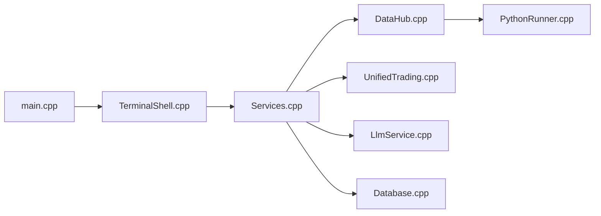

# Fincept-Corporation/FinceptTerminal

> Terminal desktop C++/Qt d'analyse financière avec analytics Python et agents IA, édition AGPL.

## Le problème
Les terminaux financiers professionnels coûtent des dizaines de milliers de dollars par poste.

## Ce que ça fait vraiment
Binaire C++20/Qt6 avec Python 3.11 embarqué : DCF, optimisation de portefeuille, VaR, dérivés, suite QuantLib.
100+ connecteurs de données (FRED, FMI, Banque mondiale, Yahoo Finance, Polygon…) diffusés via un `DataHub` interne.
37 agents IA (clé LLM à fournir), moteur d'algo et backtesting, paper trading, 16 courtiers, éditeur de nœuds, MCP.
Persistance SQLite locale, sync cloud optionnelle.

## Comment c'est branché


## Essayer
```bash
sudo apt install ./FinceptTerminal-*.deb
```
Compilation : `git clone … && ./setup.sh` (commande tronquée dans le README).

## Coût et pièges
Données et LLM à tes frais, facturés au jeton sans plafond. Toolchain épinglée (CMake 3.27.7, Qt 6.8.3, Python 3.11.9).

## Ce que ce n'est pas
Pas l'édition développée au quotidien : le dépôt ne reçoit qu'une release par mois, l'effort va à l'Enterprise fermée. README très commercial.

## Alternatives
Aucune alternative nommée dans le README (Bloomberg cité pour le prix seulement).

## Pour toi
Curiosité pour la finance quanti perso ; ne pas bâtir dessus.
