# FlagOpen/FlagEmbedding

> Boîte à outils BGE d'embeddings et de rerankers pour la recherche et le RAG, multilingue.

## Le problème
Un pipeline RAG a besoin d'un embedder et d'un reranker cohérents entre eux, et souvent multilingues.
Passer d'un modèle à l'autre, puis le fine-tuner et l'évaluer, se fait d'habitude avec trois bases de code différentes.

## Ce que ça fait vraiment
Charge un modèle par `FlagAutoModel.from_finetuned(...)`, encode des phrases, et la similarité s'obtient par produit interne.
Catalogue d'embedders : `bge-m3` (dense + sparse + multi-vecteur ColBERT, 8192 tokens), `bge-multilingual-gemma2`, `bge-en-icl` (few-shot), la famille `bge-*-v1.5` en/zh, `llm-embedder`.
Catalogue de rerankers cross-encoder : `bge-reranker-v2-m3`, `v2-gemma`, `v2-minicpm-layerwise`, `v2.5-gemma2-lightweight`, `large`, `base`.
L'extra `[finetune]` ajoute le fine-tuning d'embedder et de reranker, plus l'évaluation.

## Comment c'est branché

```mermaid
flowchart TD
  A[FlagAutoModel.from_finetuned] --> B[embedder BAAI/bge-*]
  B --> C[model.encode listes de phrases]
  C --> D[similarité produit interne]
  D --> E[reranker bge-reranker-v2-*]
  F[query_instruction_for_retrieval] --> B
  G[pip install FlagEmbedding&#91;finetune&#93;] --> H[embedder finetune / reranker finetune]
```


## Essayer
```bash
pip install -U FlagEmbedding
pip install -U FlagEmbedding[finetune]
git clone https://github.com/FlagOpen/FlagEmbedding.git
cd FlagEmbedding
pip install -e .
```

## Coût et pièges
Gratuit et local, sans clé d'API. Le piège est l'instruction de requête : chaque modèle a la sienne (`Represent this sentence for searching relevant passages: `, ou son équivalent chinois), et l'oublier dégrade la recherche.
Les rerankers cross-encoder sont annoncés plus précis mais moins efficaces : prévoir du GPU si le volume monte.

## Ce que ce n'est pas
Pas une base vectorielle : ça produit des vecteurs, le stockage et l'index sont ailleurs.
Pas un seul modèle mais un catalogue hétérogène — les modèles à base de LLM (gemma2, minicpm) ne se dimensionnent pas comme `bge-small`.
Pas un cadre RAG complet : ni chunking, ni orchestration.

## Alternatives
- LM-Cocktail : dépôt/modèles cités pour la fusion de modèles fine-tunés, pas pour l'embedding lui-même.

## Pour toi
C'est le point de départ par défaut pour l'embedding et le reranking multilingue open-weight d'un RAG.
