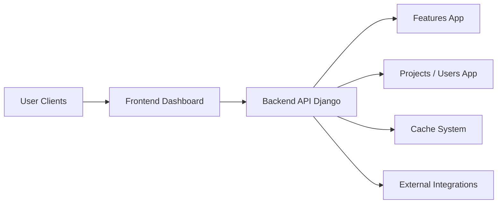

# Flagsmith/flagsmith

> Plateforme open source de feature flags et configuration distante, auto-hébergeable ou en SaaS.

## Le problème
Activer une fonctionnalité pour un segment, faire un A/B test ou couper une régression exige sinon un redéploiement.

## Ce que ça fait vraiment
API Django/DRF et tableau de bord web pour créer flags, valeurs de config distante et segments.
A/B et tests multivariés par segment ; organisations, projets, rôles.
SDK pour 15+ langages et intégrations (Slack, Datadog, GitHub…).
Fonctions de gouvernance entreprise sous licence payante ; le cœur reste BSD-3.

## Comment c'est branché


## Essayer
```bash
curl -o docker-compose.yml https://raw.githubusercontent.com/Flagsmith/flagsmith/main/docker-compose.yml
docker-compose -f docker-compose.yml up
```

## Coût et pièges
Gratuit en auto-hébergement ; SaaS gratuit pour essayer, gouvernance avancée payante.
719 issues ouvertes : gros projet, tri à faire.

## Ce que ce n'est pas
Pas un outil d'expérimentation statistique complet (analyse des résultats non documentée ici).
Pas totalement open source pour les fonctions entreprise.

## Alternatives
Aucune alternative nommée dans le README.

## Pour toi
À adopter pour piloter le déploiement progressif de modèles ou de features ML sans redéployer : outil mûr, licence permissive.
