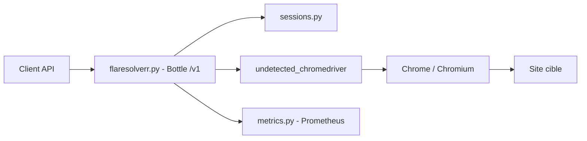

# FlareSolverr/FlareSolverr

> Serveur proxy local qui pilote un vrai Chrome pour récupérer pages et cookies derrière Cloudflare ou DDoS-GUARD.

## Le problème
Un client HTTP classique (script, scraper) est bloqué par les pages de vérification anti-bot. Il lui faut un navigateur réel pour obtenir la page et les cookies de session.

## Ce que ça fait vraiment
Une API JSON sur `/v1` (port 8191) : `request.get`, `request.post` et des sessions persistantes. Pour chaque requête, un Chrome est lancé via Selenium et undetected-chromedriver ; il attend la fin du défi, puis renvoie HTML, cookies, user-agent, éventuellement capture d'écran. Les cookies peuvent ensuite servir à d'autres clients HTTP, à condition de reprendre le même user-agent. Export Prometheus optionnel (port 8192).

## Comment c'est branché


## Essayer
```bash
docker run -d \
  --name=flaresolverr \
  -p 127.0.0.1:8191:8191 \
  -e LOG_LEVEL=info \
  --restart unless-stopped \
  ghcr.io/flaresolverr/flaresolverr:latest

curl -L -X POST 'http://localhost:8191/v1' \
-H 'Content-Type: application/json' \
--data-raw '{"cmd": "request.get", "url": "http://www.google.com/", "maxTimeout": 60000}'
```

## Coût et pièges
Pas de clé ni de compte, mais un navigateur par requête : la RAM monte vite, les sessions doivent être fermées (`sessions.destroy`). Le README interdit d'exposer le service à Internet (risque d'abus) ; le publier sur 127.0.0.1.

## Ce que ce n'est pas
Ce n'est pas une garantie de passage : le README indique qu'aucun résolveur de captcha ne fonctionne actuellement. C'est un outil à double usage : son emploi doit respecter les conditions d'utilisation et la loi applicables aux sites visés.

## Alternatives
- FlareSolverrSharp : implémentation C# citée dans « Related projects ».

## Pour toi
À surveiller : utile pour alimenter un pipeline de collecte de données sur des sources que tu as le droit de consulter, mais fragile face à l'évolution des protections, gourmand en RAM et sans solveur de captcha.
