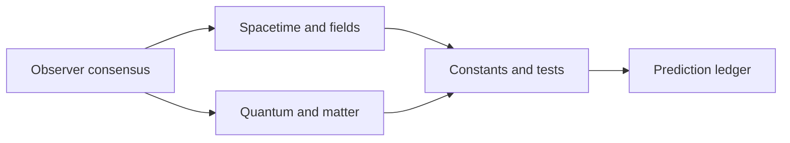

# FloatingPragma/observer-patch-holography

> Programme de recherche qui vise une théorie du tout à partir d'observateurs finis, avec papiers, preuves Lean et simulations.

## Le problème
Le dépôt cherche à dériver mécanique quantique, thermodynamique, espace-temps et constantes physiques depuis un petit nombre d'axiomes.

## Ce que ça fait vraiment
Rassemble papiers TeX, livre, manuels, code de certificats (arithmétique rationnelle exacte), théorèmes Lean (plus de 11 300 annoncés) et registre de revendications. Trois axiomes : écran d'observateurs à douze ports, accord des observateurs, hasard maximal conditionnel. Les auteurs classent chaque résultat (théorème exact, observation, interface ouverte) et reconnaissent que la correspondance sur la constante de structure fine reste « diagnostique ».

## Comment c'est branché


## Essayer
```bash
python3 tools/check_claim_registry.py
python3 -m pytest -q code/a5_closure/test_audit.py code/capacity_readback/test_correctable_public_record_capacity.py
```
Le README en liste cinq fichiers de tests ; la reproduction complète est dans un guide séparé.

## Coût et pièges
Peu de dépendances déclarées, mais le guide de reproduction n'est pas dans le README. Les affirmations sont celles de l'auteur : aucune validation externe n'est citée.

## Ce que ce n'est pas
Pas un logiciel ni un outil de données. Le README précise que l'approche ne prétend pas que la pensée humaine fabrique la réalité. Une théorie physique non consensuelle.

## Alternatives
Aucune alternative citée dans le README.

## Pour toi
À ignorer : recherche théorique de physique sans lien avec un travail data / IA / MLOps, à la licence non reconnue et aux résultats non validés.
