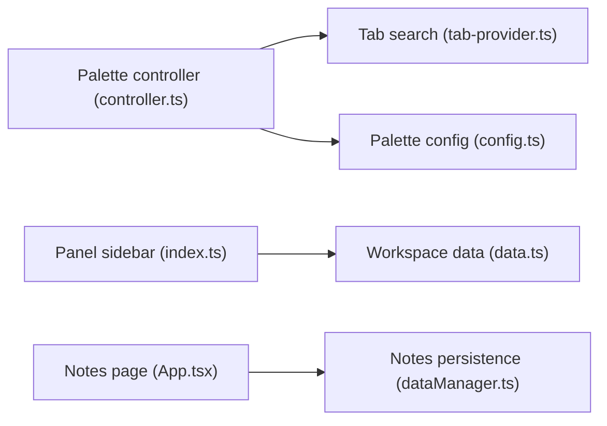

# Floorp-Projects/Floorp

> Navigateur de bureau dérivé de Firefox, avec onglets d'espaces de travail et palette de commandes.

## Le problème
Les navigateurs courants offrent peu de personnalisation d'interface et d'organisation des onglets.

## Ce que ça fait vraiment
Fork de Firefox (MPL-2.0) avec palette de commandes (onglets, favoris, historique), barre latérale de panneaux, espaces de travail, vue scindée, onglets épinglés, page de notes, gestionnaire de profils. Installeurs Windows (signé), macOS (notarisé), Linux (PPA, Flatpak, tarball). Chaîne de build via Deno (`feles-build`).

## Comment c'est branché


## Essayer
```bash
winget install Ablaze.Floorp
brew install --cask floorp
```

## Coût et pièges
Gratuit. Windows 10+ x86_64 uniquement ; une politique de confidentialité existe, détail non précisé dans le README (alerte télémétrie par prudence, non prouvée).

## Ce que ce n'est pas
Pas affilié à Mozilla. Aucun lien avec data/IA.

## Alternatives
Aucune nommée (Firefox est la base).

## Pour toi
À ignorer : un navigateur ne relève pas de ta veille data/IA/MLOps ; Firefox suffit.

