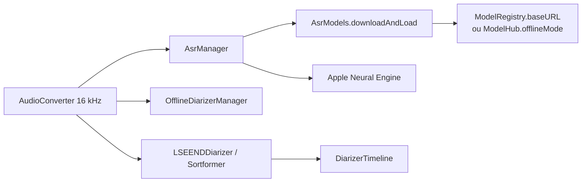

# FluidInference/FluidAudio

> SDK Swift d'IA audio locale sur le Neural Engine Apple, pour développeurs d'apps macOS et iOS.

## Le problème
Faire de la transcription ou de la diarisation sur un Mac passe par le CPU ou le GPU : batterie,
mémoire, et une app qui ne tient pas en tâche de fond.
Intégrer des modèles ONNX ou PyTorch dans une app Swift est un chantier à part.

## Ce que ça fait vraiment
ASR Parakeet TDT v3 (25 langues européennes) et v2 (anglais, meilleur rappel), SenseVoice et
Paraformer pour le mandarin, Parakeet EOU (120M) en streaming avec détection de fin d'énoncé.
Normalisation inverse du texte (« two hundred » → « 200 ») via text-processing-rs.
TTS Kokoro (82M, 9 langues, SSML), PocketTTS en streaming avec clonage de voix, Chatterbox en bêta.
Diarisation hors ligne (Pyannote Community-1 : segmentation powerset + WeSpeaker + VBx),
et en ligne LS-EEND (jusqu'à 10 locuteurs, trames de 100 ms) ou Sortformer (4 locuteurs, identités plus stables).
Extraction d'embeddings de locuteur, VAD Silero. Facteur temps réel ~190x sur M4 Pro.

## Comment c'est branché


## Essayer
```bash
swift run fluidaudiocli transcribe audio.wav
swift run fluidaudiocli transcribe audio.wav --model-version v2
swift run fluidaudiocli process meeting.wav --mode offline --threshold 0.6 --output es2004a_offline.json
swift run fluidaudiocli diarization-benchmark --mode offline --auto-download --single-file ES2004a
claude mcp add -s user -t http deepwiki https://mcp.deepwiki.com/mcp
```

## Coût et pièges
Gratuit, tout local, rien ne part sur le réseau à l'inférence. Mais les modèles se téléchargent
depuis HuggingFace au premier lancement : prévoir `REGISTRY_URL` pour un miroir, `https_proxy`
derrière un pare-feu, ou `ModelHub.offlineMode = true` pour interdire tout fetch et embarquer
ses propres poids. Sortformer est sous NVIDIA Open Model License, distincte des autres modèles.

## Ce que ce n'est pas
Ce n'est pas multiplateforme : c'est Apple, avec inférence sur l'ANE et GPU/MPS explicitement évité.
Ce n'est pas un service de transcription clé en main : c'est un SDK à intégrer.
Ce n'est pas un entraîneur de modèles — les poids sont convertis par l'équipe et publiés sur HuggingFace.

## Alternatives
Les wrappers officiels react-native-fluidaudio et fluidaudio-rs pour un autre framework ;
möbius pour convertir ses propres modèles ; text-processing-rs pour le post-traitement.

## Pour toi
Le meilleur choix local sur Mac pour ASR et diarisation ; inutile si ta cible n'est pas Apple.
