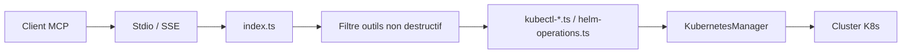

# Flux159/mcp-server-kubernetes

> Serveur MCP qui pilote un cluster Kubernetes (kubectl, Helm) depuis un assistant IA, avec mode non destructif.

## Le problème
Diagnostiquer un pod ou déployer un chart demande d'enchaîner des commandes `kubectl` que l'assistant ne peut pas lancer seul.

## Ce que ça fait vraiment
Il expose des outils MCP : `kubectl_get`, `describe`, `logs`, `apply`, `scale`, `rollout`, `patch`, `port_forward`, opérations Helm, nettoyage de pods, gestion de nœuds, plus le prompt `k8s-diagnose`. Le mode `ALLOW_ONLY_NON_DESTRUCTIVE_TOOLS` retire suppression, désinstallation et drain. Les secrets sont masqués dans `kubectl get secrets`. Le traçage OpenTelemetry est optionnel.

## Comment c'est branché


## Essayer
```bash
claude mcp add kubernetes -- npx mcp-server-kubernetes
ALLOW_ONLY_NON_DESTRUCTIVE_TOOLS=true npx mcp-server-kubernetes
```

## Coût et pièges
Gratuit. Exige `kubectl` dans le `PATH`, un kubeconfig valide, et Helm v3 en option. L'assistant agit avec tes droits : ne pas le brancher sur un cluster de production sans le mode non destructif ; `kubectl_generic` est désactivé dans ce mode.

## Ce que ce n'est pas
Pas un opérateur ni un outil de gouvernance : il exécute des commandes pour le compte du modèle. Le masquage des secrets ne touche pas les logs.

## Alternatives
Aucune alternative nommée dans le README.

## Pour toi
À adopter en mode non destructif : il donne à un assistant un accès contrôlé à un cluster, utile en MLOps ; mode lecture/écriture à réserver à un environnement de test.
