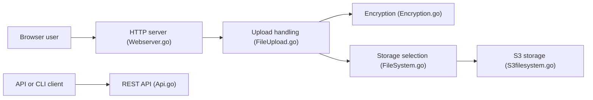

# Forceu/Gokapi

> Serveur auto-hébergé de partage de fichiers à expiration, alternative à Firefox Send.

## Le problème
Envoyer un fichier volumineux sans le laisser traîner indéfiniment chez un tiers.

## Ce que ça fait vraiment
Serveur Go : liens qui expirent après N téléchargements ou N jours, comptes avec rôles, demandes de fichiers, déduplication, chiffrement (dont de bout en bout), stockage local ou S3, OpenID Connect, API REST. Base SQLite ou Redis, assistant de configuration au premier lancement.

## Comment c'est branché


## Essayer
```bash
docker run --rm \
  --name gokapi \
  -v gokapi-data:/app/data \
  -v gokapi-config:/app/config \
  -p 127.0.0.1:53842:53842 \
  -e TZ=UTC \
  docker.io/f0rc3/gokapi:latest
```
Puis ouvrir `http://localhost:53842/setup`.

## Coût et pièges
Gratuit ; 256 Mo de RAM minimum. Le stockage disque ou S3 est à ta charge. AGPL-3.0 : les modifications servies en réseau doivent être publiées.

## Ce que ce n'est pas
Pas un outil data/IA. Le câblage interne n'est pas entièrement documenté (le graphe le signale).

## Alternatives
- Firefox Send : le service dont il se veut l'alternative (arrêté, selon le nom du projet).

## Pour toi
À ignorer pour ton métier : bon outil de partage de fichiers, mais hors de la veille data/IA/MLOps ; garde-le seulement si tu as ce besoin en interne.
