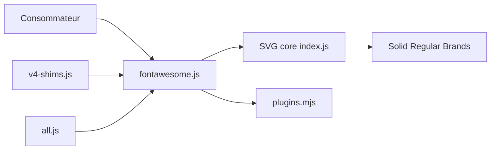

# FortAwesome/Font-Awesome

> Bibliothèque d'icônes et boîte à outils pour designers et développeurs web, version 7 gratuite.

## Le problème
Avoir des icônes cohérentes dans une interface sans les dessiner une à une.

## Ce que ça fait vraiment
Fournit des collections d'icônes gratuites (solid, regular, brands) et un runtime JavaScript qui remplace du contenu DOM par du SVG. Le dépôt contient aussi un noyau SVG séparé, des bundles (all.js, solid.js…) et des shims pour la version 4. La version 6 est en support long terme, les versions 3 à 5 sont en fin de vie.

## Comment c'est branché

## Essayer
Aucune commande documentée dans ce README : il renvoie à la documentation de la version 7.

## Coût et pièges
Gratuit pour cette édition Free. Le versionnage s'écarte de SemVer : une version mineure peut casser la compatibilité, avec instructions dans UPGRADING.md.

## Ce que ce n'est pas
Pas toute la gamme : la mention « Free » concerne cette distribution. Un patch ne retire jamais d'icône, mais le design d'une icône peut changer. Licence présente mais non identifiée par GitHub.

## Alternatives
Aucune alternative nommée dans le README.

## Pour toi
Adopter si tu bâtis une interface (démo, dashboard) : icônes prêtes à l'emploi, vérifie la licence des fichiers avant redistribution.

