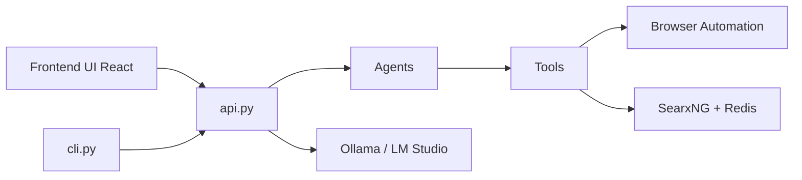

# Fosowl/agenticSeek

> Assistant agentique local (navigation web, code, planification) pensé pour des LLM auto-hébergés.

## Le problème
Les assistants agentiques type Manus envoient données et requêtes dans le cloud, avec un coût d'API récurrent.

## Ce que ça fait vraiment
Routage automatique vers des agents (planner, coder, file, browser, casual) avec interpréteurs Python, C, Go, Java, Bash.
Navigation via Selenium (mode furtif) et recherche via SearxNG + Redis en Docker.
Fournisseurs locaux (Ollama, LM Studio, serveur OpenAI-compatible) ou API (OpenAI, Gemini, DeepSeek…).
Interface web React (localhost:3000) ou CLI ; voix expérimentale.

## Comment c'est branché


## Essayer
```bash
git clone https://github.com/Fosowl/agenticSeek.git
cd agenticSeek
mv .env.example .env
./start_services.sh full
uv run cli.py
```

## Coût et pièges
Gratuit en local mais GPU 12 Go minimum (14B), 24 Go recommandés. Premier démarrage Docker jusqu'à 30 min ; ChromeDriver souvent désaccordé.

## Ce que ce n'est pas
Prototype sans roadmap ni financement ; le routage d'agents se trompe souvent. Le mode furtif et l'extension anticaptcha posent des questions d'usage.

## Alternatives
Aucune alternative open source nommée dans le README (Manus cité comme service concurrent).

## Pour toi
Surveiller : démonstrateur intéressant d'agent 100 % local, mais trop fragile et GPL-3.0 pour une brique de production.
