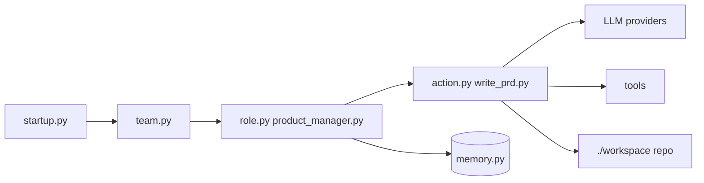

# FoundationAgents/MetaGPT

> Framework Python multi-agents qui simule une équipe logicielle (PM, architecte, ingénieur) à partir d'une phrase.

## Le problème
Passer d'une exigence d'une ligne à des specs, une conception et du code demande de coordonner plusieurs étapes que des agents isolés enchaînent mal.

## Ce que ça fait vraiment
Philosophie `Code = SOP(Team)` : une équipe (`team.py`) de rôles (`role.py` : product manager, architecte, chef de projet, ingénieur, QA) exécute des actions atomiques (`action.py`, `write_prd.py`…) selon des procédures écrites.
En sortie : user stories, analyse concurrentielle, exigences, structures de données, API, documents, et un dépôt généré dans `./workspace`.
Autour : adaptateurs LLM (`provider/` : OpenAI, Azure, Anthropic, Ollama…), mémoire, RAG (BM25, FAISS, Chroma), outils (navigateur, shell, git), Data Interpreter pour l'analyse de données, extensions (Stanford Town, Werewolf, AFLOW).

## Comment c'est branché


## Essayer
```bash
pip install --upgrade metagpt
metagpt --init-config
metagpt "Create a 2048 game"
```

## Coût et pièges
Clé d'API LLM dans `~/.metagpt/config2.yaml`, à ta charge ; un projet complet enchaîne beaucoup d'appels. Python 3.9 à 3.11 ; node et pnpm requis.

## Ce que ce n'est pas
Pas un générateur fiable d'applis réelles : la démo phare est un jeu 2048. Le framework est vaste (environnements, extensions de recherche) : la prise en main dépasse le simple `pip install`.

## Alternatives
Aucune alternative nommée dans le README.

## Pour toi
À surveiller ; le Data Interpreter est la seule pièce directement utile à un profil data.
