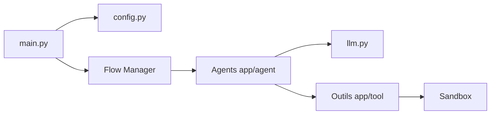

# FoundationAgents/OpenManus

> Cadre Python open source pour agents généralistes pilotés par un modèle de langage, sans code d'invitation.

## Le problème
Les agents généralistes propriétaires sont sur invitation ; ce projet propose une alternative que l'on fait tourner soi-même.

## Ce que ça fait vraiment
Un lanceur en terminal (`main.py`, `run_mcp.py`, `run_flow.py`) lit un `config.toml`, charge un agent (général, analyse de données, navigateur, SWE), passe par un adaptateur LLM vers l'API configurée et appelle des outils (bash, exécution Python, recherche, navigateur via Browser Use, visualisation). Un bac à sable Docker existe ; la version multi-agents est qualifiée d'instable par le README.

## Comment c'est branché


## Essayer
```bash
uv venv --python 3.12
uv pip install -r requirements.txt
cp config/config.example.toml config/config.toml
python main.py
```

## Coût et pièges
Clé d'API LLM à ta charge (exemple gpt-4o). Le navigateur cloud demande `BROWSER_USE_API_KEY`. Le mode multi-agents est instable.

## Ce que ce n'est pas
Ce n'est pas une garantie de résultats équivalents à Manus. Le rapport d'architecture est probablement antérieur au README (navigation : Browser Use CLI par défaut).

## Alternatives
Aucune alternative nommée dans le README (mention de Manus et d'OpenManus-RL).

## Pour toi
Surveiller : intéressant pour étudier un agent outillé, mais prototype dont la facture LLM et la stabilité restent à mesurer.

