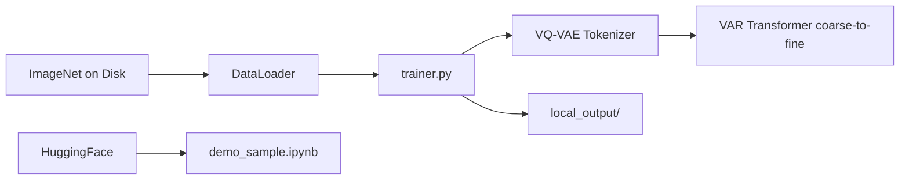

# FoundationVision/VAR

> Code et poids de VAR, génération d'images autorégressive par prédiction d'échelle suivante (NeurIPS 2024).

## Le problème
Les modèles autorégressifs d'images qui prédisent jeton après jeton en balayage restaient derrière les modèles de diffusion en qualité.

## Ce que ça fait vraiment
VAR prédit l'image de grossier à fin, résolution par résolution, avec un tokenizer VQ-VAE multi-échelle et un Transformer. Le dépôt fournit l'entraînement sur ImageNet 256 et 512 (`train.py` via `torchrun`, reprise automatique des checkpoints), des modèles de 310M à 2,3B paramètres sur Hugging Face (FID 1,80 à 256 px) et un notebook d'échantillonnage. Le script d'échantillonnage est annoncé « plus tard ».

## Comment c'est branché


## Essayer
```bash
pip3 install -r requirements.txt
torchrun --nproc_per_node=8 --nnodes=... --node_rank=... --master_addr=... --master_port=... train.py --depth=16 --bs=768 --ep=200 --fp16=1 --alng=1e-3 --wpe=0.1
tensorboard --logdir=local_output/
```

## Coût et pièges
Entraînement prévu sur 8 GPU par nœud et plusieurs nœuds, ImageNet à télécharger. L'inférence seule passe par le notebook et le VAE `vae_ch160v4096z32.pth`.

## Ce que ce n'est pas
Pas un générateur texte-vers-image : ce dépôt porte sur la génération conditionnée par classe ImageNet ; le texte-vers-image n'est que sur la démo en ligne.

## Alternatives
- FoundationVision/Infinity : suite bitwise pour la haute résolution.
- mit-han-lab/hart : transformer autorégressif hybride pour une génération plus efficace.

## Pour toi
À surveiller : article phare qui a lancé une lignée de travaux (tableau de dérivés fourni), utile pour comprendre l'autorégressif en vision, mais le reproduire demande un cluster GPU.
