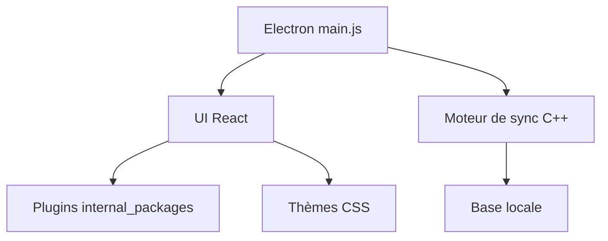

# Foundry376/Mailspring

> Client de messagerie de bureau extensible, successeur de Nylas Mail, avec moteur de synchronisation en C++.

## Le problème
Les clients mail sont lourds, gourmands en batterie, ou envoient tes identifiants dans le nuage d'un tiers.

## Ce que ça fait vraiment
Application Electron/React en TypeScript avec un moteur de synchronisation C++ (Mailcore2) lancé localement. Fonctions : boîte unifiée, report d'envoi, rappel, règles, modèles, plugins et thèmes en CSS. La version Pro payante ajoute suivi de liens, accusés de lecture et analytique. Les fonctions tournent dans le client ; le README affirme que les identifiants ne partent pas dans le nuage. Traductions supportées.

## Comment c'est branché


## Essayer
```bash
export npm_config_arch=x64
npm install
npm start
npm run-script build
```

## Coût et pièges
Gratuit ; abonnement pour Pro. L'architecture décrite par le graphe est peu détaillée. Le magasin de plugins est annoncé « bientôt » : il faut les installer à la main.

## Ce que ce n'est pas
Ce n'est pas un service : c'est un client à installer. Ce n'est pas totalement gratuit.

## Alternatives
Le README cite Nylas Mail dont il est issu.

## Pour toi
À ignorer : application de messagerie sans lien avec ton domaine data/IA/MLOps.

