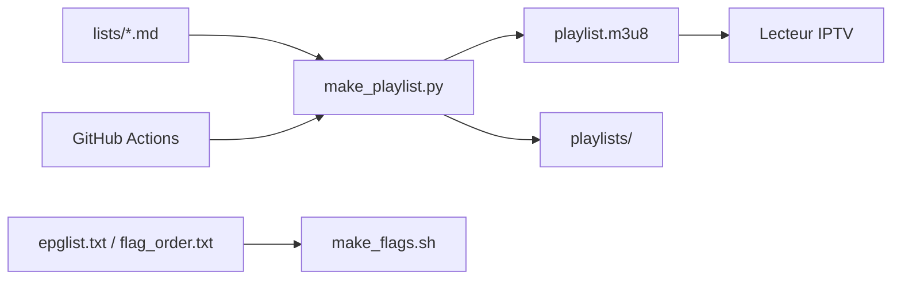

# Free-TV/IPTV

> Playlist M3U de chaînes de télévision gratuites du monde entier, pour lecteurs IPTV.

## Le problème
Trouver des flux de chaînes réellement gratuites, à jour et en bonne qualité, sans mélange avec des offres payantes.

## Ce que ça fait vraiment
Des fichiers Markdown par groupe dans `lists/` sont convertis en `playlist.m3u8` par `make_playlist.py`. Seules les lignes dont l'URL commence par `[>]` sont retenues. Des marqueurs signalent les chaînes SD, géobloquées ou YouTube. `make_flags.sh` gère les drapeaux, des workflows GitHub testent et régénèrent la playlist. Philosophie : peu de chaînes, une URL par chaîne, gratuites et grand public.

## Comment c'est branché

## Essayer
Pointer le lecteur IPTV vers `https://raw.githubusercontent.com/Free-TV/IPTV/master/playlist.m3u8`. Aucune autre commande n'est documentée.

## Coût et pièges
Gratuit, sans licence déclarée : réutilisation à clarifier. Les flux dépendent de fournisseurs tiers et peuvent casser ou être géobloqués. Ne modifier que les `.md` dans une PR.

## Ce que ce n'est pas
Ce n'est pas un hébergeur de flux : le dépôt ne diffuse rien, il liste des URL. Pas de contrôle sur la légalité locale.

## Alternatives
Une source de flux est citée dans le README : `iptv-org/iptv` (dossier `streams`).

## Pour toi
Ignorer : liste de loisir sans usage data / IA, et sans licence déclarée.

