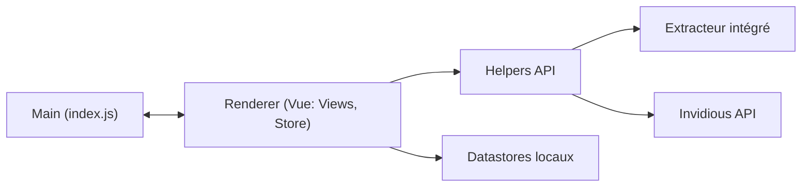

# FreeTubeApp/FreeTube

> Lecteur YouTube de bureau open source, centré sur la vie privée, pour regarder sans publicité ni compte.

## Le problème
YouTube pose des cookies, du suivi et de la publicité, et impose un compte pour s'abonner.

## Ce que ça fait vraiment
Application Electron avec un extracteur intégré (ou l'API Invidious en option). Elle n'utilise aucune API officielle. Abonnements, playlists et historique restent stockés en local. Elle gère SponsorBlock, DeArrow, profils d'abonnements, lecteur externe, mini-lecteur et thèmes. Le renderer est en Vue, avec un processus principal Electron.

## Comment c'est branché

## Essayer
Le README renvoie aux téléchargements (GitHub Releases, site officiel, Flatpak sur Flathub) ; aucune commande n'y figure.

## Coût et pièges
Gratuit, sans compte. Le README recommande VPN ou Tor : YouTube voit toujours les requêtes vidéo. Les builds automatiques (nightly) exigent un compte GitHub et sont sans garantie. Statut « bêta ». Licence AGPL-3.0.

## Ce que ce n'est pas
Pas un outil d'analyse ou de téléchargement de données. Il ne garantit pas l'anonymat.

## Alternatives
Aucune alternative citée dans le README (Invidious sert de source de données, pas de remplaçant).

## Pour toi
Ignorer : application grand public sans usage pour un pipeline data ou IA ; la licence AGPL compte seulement si tu comptes réutiliser son code.

