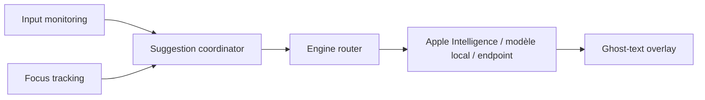

# FuJacob/cotabby

> Autocomplétion IA en texte fantôme dans presque tous les champs de texte de macOS, exécutée en local.

## Le problème
Les suggestions d'écriture IA sont enfermées dans quelques applis et envoient souvent tes frappes dans le cloud.

## Ce que ça fait vraiment
Observe la saisie et le champ actif, construit une requête, l'envoie au moteur choisi, affiche la suggestion en gris (Tab accepte un mot). Trois moteurs : Apple Intelligence (macOS 26+), modèles GGUF locaux via llama.cpp (Qwen3.5, gemma-4, de 0,8 à 5 Go), ou point d'accès compatible OpenAI. Ajoute emojis, macros `/` et autocorrection. Champs mot de passe bloqués.

## Comment c'est branché


## Essayer
```bash
brew tap FuJacob/cotabby
brew install --cask cotabby
```

## Coût et pièges
Gratuit. Demande les permissions Accessibilité et Input Monitoring (Screen Recording optionnel) : c'est un lecteur de frappes. Bêta, tenu par deux étudiants ; licence AGPL-3.0.

## Ce que ce n'est pas
Pas un assistant de chat. macOS uniquement (14+), sans Windows ni Linux.

## Alternatives
Le README ne cite aucune alternative.

## Pour toi
À surveiller : curiosité intéressante pour l'inférence locale, mais les permissions sensibles et l'AGPL invitent à la prudence.
