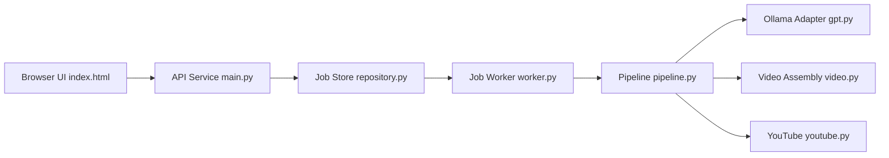

# FujiwaraChoki/MoneyPrinter

> Générateur automatique de YouTube Shorts à partir d'un sujet, avec LLM local Ollama.

## Le problème
Produire des vidéos courtes en série (script, voix, montage) est répétitif.

## Ce que ça fait vraiment
D'après l'architecture : UI web minimale → API (`main.py`) → file de jobs en Postgres → worker.
Le pipeline génère script et métadonnées via Ollama, cherche des contenus, synthétise la voix, assemble la vidéo, publie éventuellement sur YouTube.
File persistante résistante aux redémarrages.

## Comment c'est branché


## Essayer
```bash
ollama serve
ollama pull llama3.1:8b
```

## Coût et pièges
Ollama local, ImageMagick requis ; la voix TikTok demande un cookie `sessionid` de ton compte.

## Ce que ce n'est pas
Pas une « machine à argent » : c'est un pipeline de contenu automatisé. README surtout FAQ, installation renvoyée vers `docs/`.

## Alternatives
Aucune alternative nommée dans le README.

## Pour toi
À ignorer : production de contenu en masse, sans intérêt data/ML hormis comme exemple de file de jobs en Postgres.
