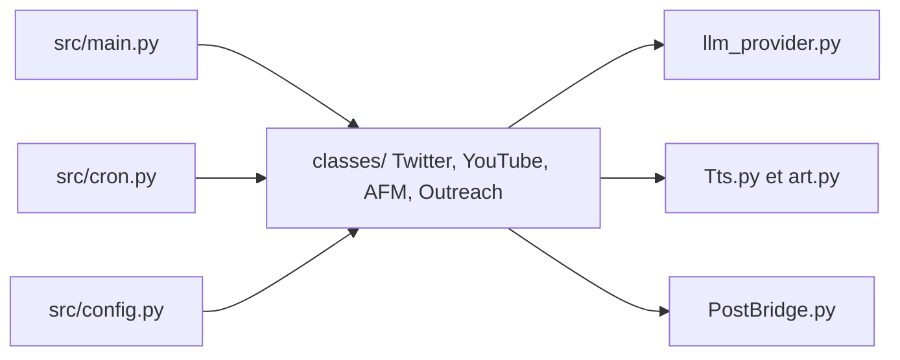

# FujiwaraChoki/MoneyPrinterV2

> Application Python en ligne de commande qui automatise bots Twitter, YouTube Shorts, affiliation et prospection locale.

## Le problème
Produire et publier du contenu en ligne de façon régulière prend du temps : idées, voix, montage, planification, publication.

## Ce que ça fait vraiment
Une seule application CLI (src/main.py) propose quatre flux : bot Twitter, YouTube Shorts, marketing d'affiliation Amazon et recherche de commerces locaux avec prospection par e-mail. Un planificateur (src/cron.py) lance les tâches récurrentes. D'après le code : llm_provider.py isole le modèle, Tts.py et art.py assemblent le média, et une intégration Post Bridge pousse le contenu.

## Comment c'est branché


## Essayer
```bash
git clone https://github.com/FujiwaraChoki/MoneyPrinterV2.git
cd MoneyPrinterV2
cp config.example.json config.json
python -m venv venv
source venv/bin/activate
pip install -r requirements.txt
python src/main.py
```

## Coût et pièges
Python 3.12 requis ; Go est nécessaire pour la prospection par e-mail. Les clés et comptes (Twitter, YouTube, Post Bridge) sont à remplir dans config.json. Licence AGPL-3.0 : obligations de partage si tu proposes le service en réseau.

## Ce que ce n'est pas
Aucun revenu garanti, malgré le slogan : le README se limite à un avertissement « usage éducatif ». L'automatisation de publications et de prospection peut contredire les conditions d'usage des plateformes.

## Alternatives
- MoneyPrinterTurbo : version chinoise citée dans le README.

## Pour toi
À ignorer : automatisation de contenu et de prospection sans lien avec data/IA/MLOps, sous licence AGPL, et dépendante de services tiers.

