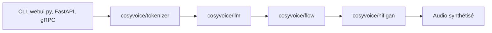

# FunAudioLLM/CosyVoice

> Synthèse vocale multilingue à clonage de voix zéro-shot, pour développeurs de produits audio.

## Le problème
Les voix synthétiques ouvertes gèrent mal plusieurs langues, les dialectes et la voix d'un locuteur inconnu.

## Ce que ça fait vraiment
Système TTS à base de LLM : 9 langues, 18 dialectes chinois, clonage inter-langue, instructions (émotion, débit, volume) et streaming texte-entrée / audio-sortie annoncé à 150 ms. Fun-CosyVoice3-0.5B est le modèle recommandé. Serveurs FastAPI et gRPC fournis, accélération TensorRT-LLM et vLLM documentées.

## Comment c'est branché


## Essayer
```bash
git clone --recursive https://github.com/FunAudioLLM/CosyVoice.git
conda create -n cosyvoice -y python=3.10
pip install -r requirements.txt
python example.py
```

## Coût et pièges
GPU nécessaire (images Docker lancées avec `--runtime=nvidia`). Les poids se téléchargent via ModelScope ou Hugging Face. Le README pointe un miroir Aliyun pour pip. Sox et sous-modules git à gérer.

## Ce que ce n'est pas
Pas une API hébergée. Le disclaimer précise un usage académique, et des exemples sont tirés d'Internet. Licence non déclarée : à vérifier avant tout usage commercial.

## Alternatives
- F5-TTS, Spark TTS, Index-TTS2, VoxCPM : modèles ouverts comparés dans le tableau d'évaluation du README.

## Pour toi
À surveiller : pertinent si tu construis de la voix, mais la licence non déclarée et le GPU obligatoire freinent un usage direct.
