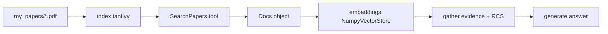

# Future-House/paper-qa

> RAG agentique sur PDF et littérature scientifique, avec citations dans le texte.

## Le problème
Interroger un corpus d'articles scientifiques avec un RAG naïf donne des réponses sans source vérifiable et rate les métadonnées de citation.

## Ce que ça fait vraiment
Indexe un dossier de PDF, récupère les métadonnées (Crossref, Semantic Scholar, Unpaywall) avec contrôle de rétractation.
Boucle en trois phases : recherche d'articles, collecte de preuves avec résumé contextualisé et re-scoring LLM, génération de la réponse.
Un agent peut réordonner ces outils, ou un agent `"fake"` suit un chemin fixe pour réduire les tokens.
Depuis décembre 2025 : tables, figures, équations, langues non anglaises, lecteurs Docling et nemotron-parse, résumé multimodal.

## Comment c'est branché


## Essayer
```bash
pip install paper-qa
mkdir my_papers
curl -o my_papers/PaperQA2.pdf https://arxiv.org/pdf/2409.13740
cd my_papers
pqa ask 'What is PaperQA2?'
```

## Coût et pièges
Par défaut tout passe par OpenAI (`gpt-4o-2024-11-20` et `text-embedding-3-small`) : clé obligatoire. Au-delà de 100 articles il faut aussi `CROSSREF_API_KEY` et `SEMANTIC_SCHOLAR_API_KEY` pour ne pas se faire limiter. Le préréglage `high_quality` est explicitement coûteux.

## Ce que ce n'est pas
Pas un outil local par défaut : le mode llama.cpp ou ollama existe mais le README prévient qu'un modèle 7B donne de mauvais résultats. Depuis décembre 2025 le projet est en CalVer, donc sans garantie de compatibilité entre versions. Les `Docs` picklés d'avant la v5 sont incompatibles.

## Alternatives
LlamaIndex et LangChain — cités dans la FAQ du README comme les comparaisons attendues.

## Pour toi
Le meilleur point de départ si tu construis un RAG sur littérature scientifique ; regarde surtout son étage de re-ranking contextualisé.
