# GH05TCREW/pentestagent

> Agent de test d'intrusion en TUI, multi-agents et compatible MCP, pour pentesteurs autorisés.

## Le problème
Un test d'intrusion enchaîne des dizaines d'outils CLI et de notes éparpillées.
Paralléliser la reconnaissance sur plusieurs sous-réseaux demande une orchestration à la main.

## Ce que ça fait vraiment
Quatre modes : `/assist` (une instruction), `/agent` (autonome), `/crew` (orchestrateur + workers),
`/interact` (guidé). Outils intégrés : `terminal`, `browser`, `notes`, `web_search`, `spawn_mcp_agent`.
Auto-essaimage : un agent lance une copie de lui-même comme serveur MCP enfant isolé, dont les outils
sont réinjectés au parent (`/spawn`, `/despawn`). Playbooks d'attaque prédéfinis.
MCP dans les deux sens : consommation de serveurs externes, et exposition en stdio ou SSE.
Au-delà de 128 outils, un `mcp__rag_optimizer` par similarité d'embeddings remplace le catalogue.
RAG sur `pentestagent/knowledge/sources/`, notes dans `loot/notes.json`, shadow graph en mode Crew.

## Comment c'est branché

```mermaid
flowchart LR
  A[TUI] --> B[agent principal]
  B --> C[tools: terminal / browser / notes]
  B --> D[spawn_mcp_agent<br/>child_agent_1..n]
  B --> E[mcp_servers.json<br/>serveurs externes]
  B --> F[mcp__rag_optimizer]
  B --> G[knowledge/ RAG + loot/notes.json]
  H[mcp_server --type stdio ou sse] --> B
```


## Essayer
```bash
git clone https://github.com/GH05TCREW/pentestagent.git
pip install -e ".[all]"
playwright install chromium
pentestagent -t 192.168.1.1
pentestagent tui --docker
docker run -it --rm -e ANTHROPIC_API_KEY=your-key ghcr.io/gh05tcrew/pentestagent:kali
pentestagent run -t example.com --playbook thp3_web
```

## Coût et pièges
Python 3.10+, clé LiteLLM (OpenAI, Anthropic ou autre) à ta charge, `TAVILY_API_KEY` pour la recherche web.
Le mode Docker isole et pré-installe les outils Kali. L'essaimage multiplie les appels de modèle,
donc la facture. Le README rappelle le cadre légal : uniquement des systèmes que tu es autorisé à tester.

## Ce que ce n'est pas
Ce n'est pas un scanner déterministe : c'est un agent qui décide de ses commandes.
Ce n'est pas une garantie de couverture — les playbooks structurent, ils ne certifient rien.
Ce n'est pas sans risque : un agent avec un terminal et msfconsole fait des dégâts hors périmètre.

## Alternatives
Aucune nommée ; seulement `gc-nmap-mcp` en exemple de serveur MCP externe.

## Pour toi
Hors de ton axe, sauf pour l'idée d'auto-essaimage MCP et du RAG sur catalogue d'outils, transposables.
