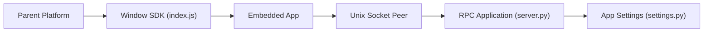

# GMSSH/GMSSH

> Plateforme d'accès SSH et de gestion multi-hôtes, plus légère qu'un panneau de contrôle, pour petites équipes.

## Le problème
Adresses, clés et comptes SSH dispersés rendent la gestion de nombreux serveurs et le partage d'accès brouillons.

## Ce que ça fait vraiment
Le README décrit surtout un positionnement : gestion d'hôtes, groupes et tags, entrée d'accès unifiée, terminal et fichiers, collaboration, composant léger lancé à la demande. Il note que les permissions et l'audit sont « en amélioration » et que la liste de capacités « peut être ajustée ». Le code fourni est un squelette (RPC Python, paquets Go, SDK JS), pas la plateforme.

## Comment c'est branché

## Essayer
Aucune commande dans le README : déploiement Docker via https://www.gm.cn/private, documentation sur https://doc.gm.cn/zh/guide/.

## Coût et pièges
Le mode Docker passe par une page externe, non documentée dans le dépôt. Aucune licence déclarée alors que le README revendique « open source ».

## Ce que ce n'est pas
Pas un bastion d'entreprise (audit et gouvernance limités), pas un panneau d'administration serveur. Le code visible ne prouve pas les fonctions annoncées.

## Alternatives
Aucune alternative nommée ; le README compare seulement par catégories (SSH natif, panneaux, bastions).

## Pour toi
À ignorer : administration de serveurs hors sujet pour la donnée ou l'IA, et l'ouverture du code n'est ni licenciée ni visible.
