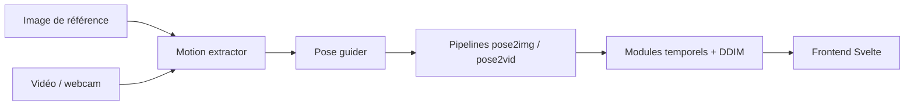

# GVCLab/PersonaLive

> Cadre de diffusion temps réel qui anime un portrait à partir d'une vidéo pilote, pour la recherche.

## Le problème
Animer un portrait en flux continu, sur durée indéfinie, exige un modèle de diffusion assez rapide et cohérent dans le temps.

## Ce que ça fait vraiment
Une image de référence est animée par le mouvement d'une vidéo ou d'une webcam. Extracteur de mouvement dérivé de LivePortrait, guide de pose, UNets 2D/3D et modules temporels, planificateur DDIM. Interface Svelte sur le port 7860 ; TensorRT pour environ 2× de vitesse. Entraînement en trois étapes (code publié).

## Comment c'est branché


## Essayer
```bash
conda create -n personalive python=3.10
conda activate personalive
pip install -r requirements_base.txt
python tools/download_weights.py
python inference_offline.py
python inference_online.py --acceleration none
```

## Coût et pièges
GPU requis ; le moteur TensorRT fourni vient d'un H100 et doit être reconstruit (`python torch2trt.py`, environ 20 minutes). Sur RTX 50, désactiver xformers. Entraînement annoncé sur 8× H100 (environ 48 h au total).

## Ce que ce n'est pas
« Recherche académique uniquement » selon l'avertissement ; ne pas générer de contenu nuisible ou diffamatoire. Un portrait animé pose un risque d'usurpation d'identité.

## Alternatives
- ComfyUI-PersonaLive : intégration ComfyUI citée.
- EditaLive : version mise à jour du même projet.

## Pour toi
À surveiller : technique intéressante si tu travailles sur la vidéo générative, mais cadre d'usage restreint à la recherche.

