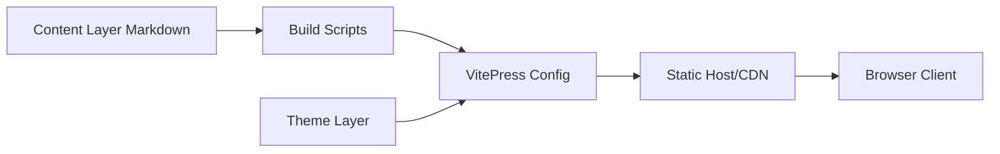

# Gar-b-age/CookLikeHOC

> Recueil de recettes en markdown inspiré du rapport de traçabilité de la chaîne Laoxiangji.

## Le problème
Non documenté au-delà du thème : reproduire les plats d'une chaîne de restauration chinoise.

## Ce que ça fait vraiment
Recettes en markdown classées par catégorie, reprises du « rapport de traçabilité des plats » de Laoxiangji.
Site statique VitePress (cooklikehoc.soilzhu.su) avec génération automatique des index.
Support Docker et version illustrée par IA.

## Comment c'est branché

## Essayer
Aucune commande documentée dans le README.

## Coût et pièges
Gratuit. Aucune licence déclarée ; contenus copiés d'un rapport commercial. Un site homonyme non officiel existe.

## Ce que ce n'est pas
Pas un outil technique ; aucun lien avec la data ou l'IA.

## Alternatives
- How To Cook : projet de recettes cité comme voisin.

## Pour toi
Ignorer : dépôt de recettes sans rapport avec un profil data/IA/MLOps.
