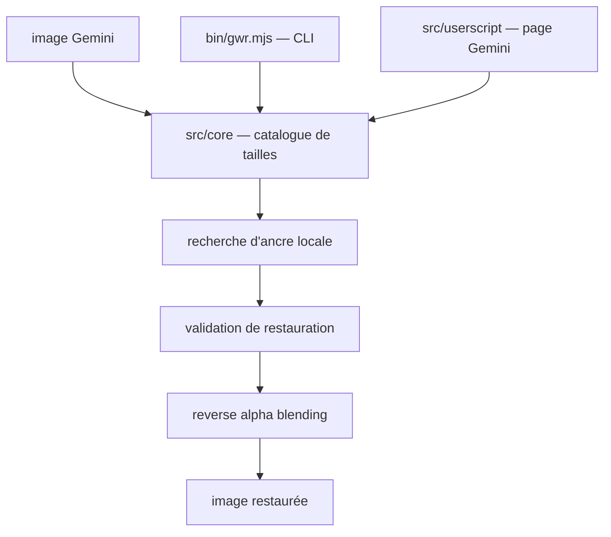

# GargantuaX/gemini-watermark-remover

> Outil JavaScript qui retire le filigrane visible des images générées par Gemini.

## Le problème
Les images produites par Gemini portent un logo semi-transparent en bas à droite.
Les retoucheurs IA « devinent » les pixels manquants et abîment l'image autour.

## Ce que ça fait vraiment
Il n'inpaint pas : il inverse l'équation de composition alpha. Gemini applique `watermarked = α·logo + (1−α)·original` ; l'outil résout `original = (watermarked − α·logo) / (1 − α)`.
La carte alpha exacte a été reconstruite en capturant le filigrane sur un fond uni connu, d'où une restauration sans perte sur les formats reconnus.
La détection est en trois couches : correspondance des dimensions avec le catalogue des tailles de sortie Gemini, recherche d'ancre locale autour de la position prédite, puis validation de la restauration avant application.
Cinq surfaces d'usage : site en ligne, extension Chrome, userscript Tampermonkey, CLI `gwr`, et un skill packagé pour agents de code.

## Comment c'est branché


## Essayer
```bash
node bin/gwr.mjs remove <input> --output <file>
gwr remove <input> [--output <file> | --out-dir <dir>] [--overwrite] [--json]
pnpm dlx @pilio/gemini-watermark-remover remove <input> --output <file>
pnpm dlx skills add GargantuaX/gemini-watermark-remover --skill gemini-watermark-remover
```

## Coût et pièges
Gratuit, MIT, tout le traitement est local — rien n'est téléversé. Le décodeur CLI par défaut exige `sharp` installé à côté du paquet.
Les extensions de défense d'empreinte Canvas font échouer le traitement ; le README pointe l'issue correspondante.

## Ce que ce n'est pas
Ce n'est pas un retrait de filigrane universel : uniquement le logo visible de Gemini, validé jusqu'en avril 2026, et rien contre les marquages invisibles type SynthID.
Le README pousse plusieurs fois vers pilio.ai, produit commercial du même auteur, pour tout le reste.
Le juridique est renvoyé à l'utilisateur : l'auteur décline toute responsabilité sur l'usage.

## Alternatives
- Gemini Watermark Tool (Allen Kuo) : l'original dont ce dépôt est le portage JavaScript.
- pilio.ai/image-watermark-remover : le service IA générique du même auteur, pour les filigranes non Gemini.

## Pour toi
Sans intérêt professionnel, mais la démonstration d'algèbre alpha est propre et le refus de l'inpainting IA est instructif.
