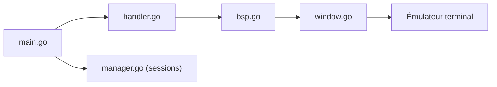

# Gaurav-Gosain/tuios

> Multiplexeur de terminal et gestionnaire de fenêtres en Go, modal, avec tuilage BSP et sessions persistantes.

## Le problème
tmux manque de tuilage dynamique, de graphismes kitty et d'une interface modale façon gestionnaire de fenêtres.

## Ce que ce n'est pas faire vraiment
Voir ci-dessous.

## Ce que ça fait vraiment
Panneaux, 9 espaces de travail, palette de commandes, lanceur d'applications, modes BSP, master-stack et défilant. Protocoles kitty (images, clavier) et sixel, mode démon avec détachement, scripts « tape », serveur SSH et terminal web. L'architecture évoque aussi des fonctions d'agents et de revue, non détaillées dans le README.

## Comment c'est branché


## Essayer
```bash
brew tap Gaurav-Gosain/tap
brew install tuios
tuios
tuios new mysession
tuios attach mysession
```

## Coût et pièges
Gratuit. Terminal true color requis ; kitty/sixel recommandés (Ghostty, Kitty, WezTerm). Dépôt créé en septembre 2025, jeune.

## Ce que ce n'est pas
Pas un remplaçant éprouvé de tmux. Sixel marqué expérimental.

## Alternatives
tmux, cité en comparaison dans le README (séparateurs, sessions détachables).

## Pour toi
Confort de terminal pour travailler sur des serveurs GPU, sans gain data direct : surveiller.

