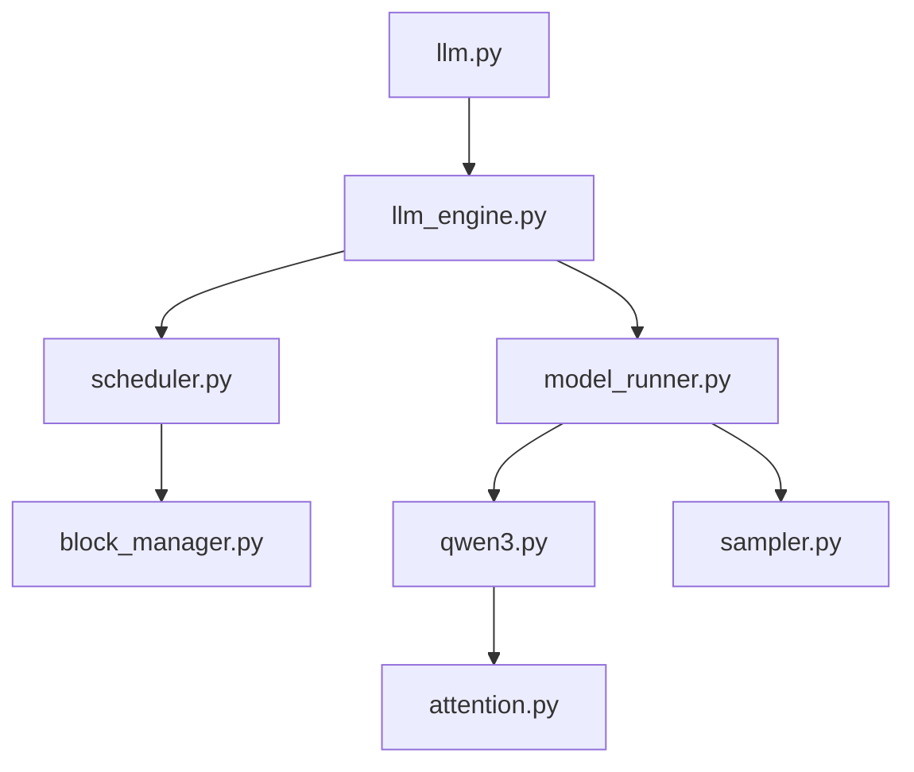

# GeeeekExplorer/nano-vllm

> Réimplémentation de vLLM en environ 1 200 lignes de Python, lisible et pédagogique.

## Le problème
Le code de vLLM est trop gros pour comprendre comment marchent le batching continu, le cache KV ou les CUDA graphs.

## Ce que ça fait vraiment
Il fait de l'inférence hors ligne avec une API proche de vLLM (`LLM.generate`, `SamplingParams`).
Il inclut un ordonnanceur par batching continu, un gestionnaire de blocs KV avec cache de préfixes, du parallélisme tensoriel, `torch.compile` et les CUDA graphs.
Seul Qwen3 est pris en charge (`qwen3.py`).
Le banc d'essai sur RTX 4070 donne 1 434 tokens/s, contre 1 362 pour vLLM.

## Comment c'est branché


## Essayer
```bash
pip install git+https://github.com/GeeeekExplorer/nano-vllm.git
huggingface-cli download --resume-download Qwen/Qwen3-0.6B --local-dir ~/huggingface/Qwen3-0.6B/ --local-dir-use-symlinks False
```

## Coût et pièges
Il faut un GPU CUDA. Il n'y a ni serveur HTTP ni streaming : seulement de l'inférence hors ligne.

## Ce que ce n'est pas
Ce n'est pas un substitut de vLLM en production : un seul modèle, pas d'API compatible OpenAI. Le banc d'essai tient sur une seule configuration.

## Alternatives
- vLLM : le moteur complet de production, que nano-vllm imite.

## Pour toi
À surveiller : une excellente ressource pour comprendre les rouages internes de l'inférence LLM, mais pas un outil à déployer.
