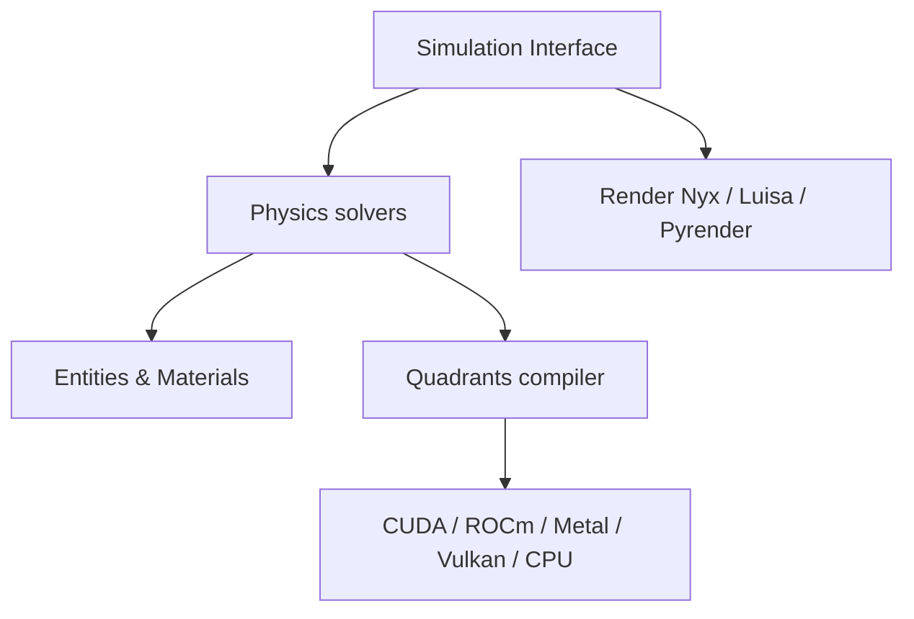

# Genesis-Embodied-AI/Genesis

> Plateforme de simulation physique pour la robotique et l'IA incarnée, pilotée en Python.

## Le problème
Entraîner et tester des robots demande un simulateur unifiant corps rigides, fluides et déformables, rapide sur GPU.

## Ce que ça fait vraiment
Interface Python de simulation (formats URDF, MJCF, USD…), moteur multi-physique (rigide, FEM, MPM, SPH, PBD, couplage), trois moteurs de rendu (Nyx, Luisa, Pyrender) et compilateur Quadrants vers CUDA, ROCm, Metal, Vulkan et CPU. Capteurs (lidar, IMU, tactile), environnements parallèles, IK différentiable.

## Comment c'est branché


## Essayer
```bash
pip install genesis-world
git clone https://github.com/Genesis-Embodied-AI/genesis-world.git
cd genesis-world
pip install -e ".[dev]"
uv run examples/rigid/single_franka.py
```

## Coût et pièges
Installer PyTorch avant. Le solveur IPC exige pyuipc et un GPU NVIDIA sous Linux/Windows x86. Python 3.10 à 3.13.

## Ce que ce n'est pas
Pas une bibliothèque d'apprentissage par renforcement : c'est le simulateur. Le README renomme le projet Genesis World ; le dépôt catalogué garde l'ancien nom.

## Alternatives
- Aucune alternative nommée dans le README.

## Pour toi
À surveiller : pertinent si tu fais de la robotique ou du RL en simulation ; sinon hors périmètre.
