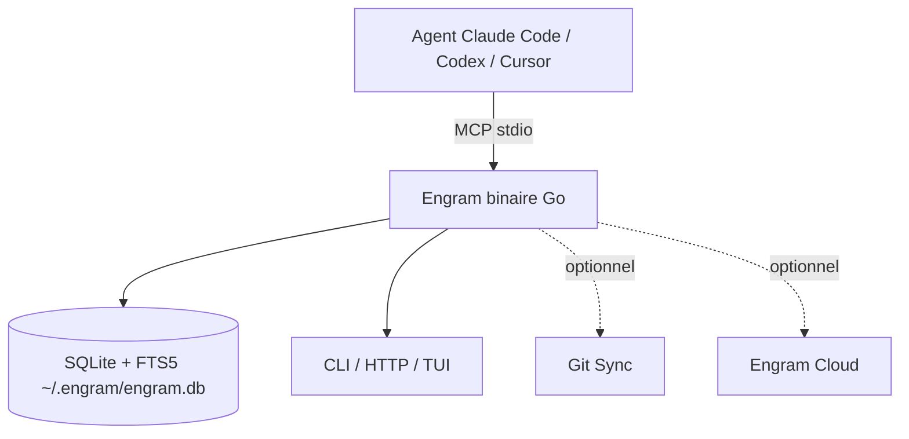

# Gentleman-Programming/engram

> Binaire Go donnant une mémoire persistante et cherchable aux agents de code via MCP.

## Le problème
Un agent de code oublie tout à la fin de session ; on ré-explique chaque matin les mêmes décisions. Aucun mécanisme pour accumuler le contexte au fil du temps.

## Ce que ça fait vraiment
Binaire Go unique avec SQLite + FTS5, exposé en CLI, HTTP API, MCP et TUI. Marche avec tout agent compatible MCP (Claude Code, OpenCode, Gemini CLI, Codex, Cursor…). Aucun Node/Python/Docker. Contrat d'usage pour agents : orienter (`mem_current_project`), chercher avant de répéter (`mem_search`), sauver délibérément (`mem_save`), clés de sujet stables (`topic_key`), handoff de fin de session. Local d'abord ; Git Sync et Engram Cloud optionnels.

## Comment c'est branché


## Essayer
```bash
brew install gentleman-programming/tap/engram
```
```bash
claude plugin marketplace add Gentleman-Programming/engram && claude plugin install engram
```

## Coût et pièges
Local gratuit. Engram Cloud (réplication) optionnel. Homebrew reste sur v1.20.0 stable ; releases candidates = risque prérelease. Mainteneur unique.

## Ce que ce n'est pas
Pas un puits à transcription : mémoire curée, pas un dump de chaque tour de conversation. Pas dépendant du cloud (local par défaut).

## Alternatives
- claude-mem : comparé explicitement dans la doc.

## Pour toi
Directement utile si tu veux une mémoire durable et cherchable pour Claude Code ; sans dépendance lourde. Surveiller (mainteneur unique).
