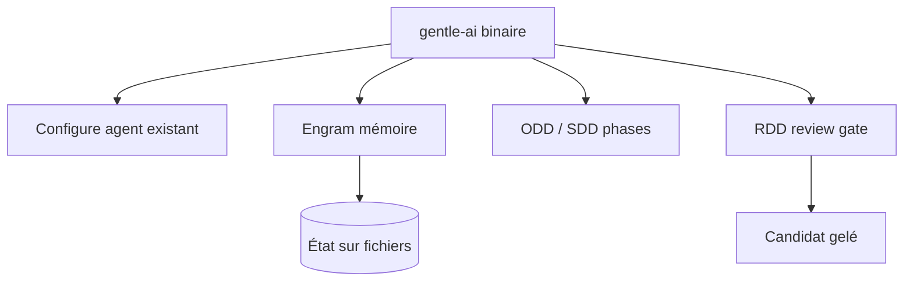

# Gentleman-Programming/gentle-ai

> Binaire Go qui donne mémoire, workflow et preuves à un agent de code existant.

## Le problème
Un agent de code oublie tout à la fin de session, n'a pas d'opinion sur le projet, et ne prouve pas ce qu'il a fait sans qu'on relise chaque ligne.

## Ce que ça fait vraiment
Configure 16 agents (Pi, Claude Code, Codex, Cursor…) sans les installer. Engram : mémoire de projet persistante. ODD (Organic Driven Development) pour petit travail léger, SDD pour phases formelles, RDD (Receipt-Driven) qui gèle un candidat avant revue. Le binaire `gentle-ai` porte l'état sur fichiers, déterministe entre machines. Skills, Context7 MCP, CodeGraph, deny-list sécurité, doctor.

## Comment c'est branché


## Essayer
```bash
brew install gentleman-programming/tap/gentle-ai
```
```bash
gentle-ai
gentle-ai doctor
```

## Coût et pièges
Gratuit (MIT sur le code). Télémétrie (page dédiée pour la couper). Mainteneur unique (Alan Buscaglia) ; marques déposées Gentle AI™/Engram™. Snapshots de config avant chaque écriture.

## Ce que ce n'est pas
N'installe jamais d'agent IA à ta place : il configure ceux que tu as déjà. Pas un agent lui-même.

## Alternatives
- Gentleman-Programming/engram : la brique mémoire seule (même auteur).

## Pour toi
Intéressant si tu multiplies les agents de code et veux une mémoire/workflow partagés ; surveiller vu le mainteneur unique.
