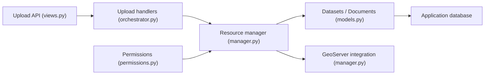

# GeoNode/geonode

> Plateforme Django de gestion et publication de données géospatiales, pour partager cartes et jeux de données.

## Le problème
Partager des couches, des métadonnées et des cartes interactives avec des utilisateurs non spécialistes exige de relier plusieurs briques SIG.

## Ce que ça fait vraiment
Reçoit des fichiers géospatiaux par API d'upload, les traite par des handlers de format, les enregistre via un gestionnaire de ressources et les synchronise avec GeoServer. Métadonnées, permissions (publiques ou restreintes), groupes, commentaires, notes, catalogue, moissonnage, cartes interactives, recherche à facettes.

## Comment c'est branché


## Essayer
```bash
python create-envfile.py
docker compose build
docker compose up -d
```

## Coût et pièges
Pile lourde (GeoServer, PostgreSQL) ; en `prod`, un email réel et une config SMTP sont requis pour Let's Encrypt. Ne pas modifier le cœur : utiliser le GeoNode Project Template.

## Ce que ce n'est pas
Pas un outil ML. Le README évoque la GPL v3 (copyleft, droits OSGeo) alors que GitHub n'identifie pas la licence : à vérifier avant réutilisation.

## Alternatives
- GeoNode Project (geonode-project) : gabarit pour personnaliser une instance.

## Pour toi
À surveiller : pertinent si tes projets manipulent des données géospatiales à publier ; hors sujet pour du ML général.
