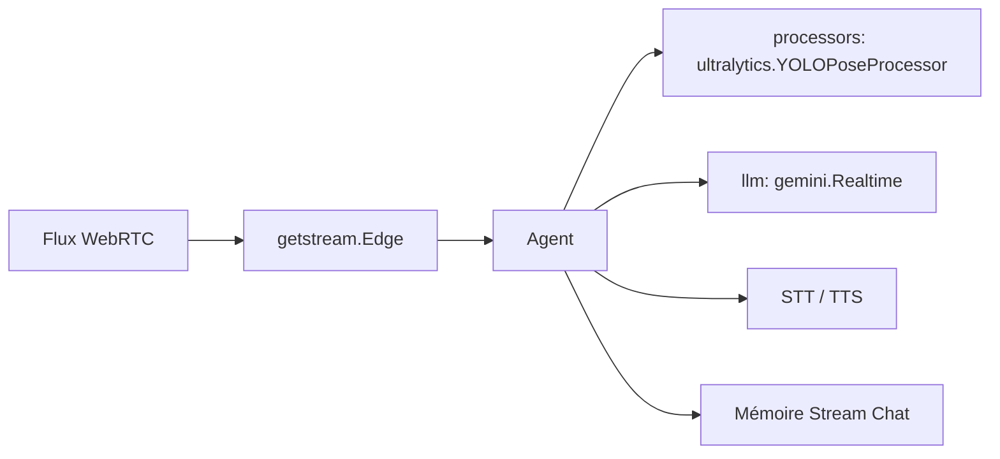

# GetStream/Vision-Agents

> Briques Python pour agents temps réel qui regardent une vidéo, écoutent et répondent en direct.

## Le problème
Brancher un modèle de vision sur un flux WebRTC demande de recoudre soi-même l'edge vidéo, la
détection de tour de parole, la STT, la TTS et l'appel au LLM, avec une latence tenable.

## Ce que ça fait vraiment
Assemble un agent à partir d'un edge (Stream par défaut), d'un LLM ou d'un modèle temps réel, et
d'une liste de *processors* vidéo qui tournent avant ou après l'appel au modèle — YOLO, Roboflow,
ONNX maison. Ajoute VAD et diarisation, appel d'outils et MCP, téléphonie Twilio/Telnyx, RAG
(TurboPuffer, Qdrant, Gemini FileSearch), mémoire de session via Stream Chat, serveur HTTP et
métriques Prometheus.

## Comment c'est branché


## Essayer
```bash
uv add vision-agents
uv add "vision-agents[getstream, openai, elevenlabs, deepgram]"
```

## Coût et pièges
Clé Stream à créer : 333 000 minutes-participant offertes par mois, au-delà c'est payant. Chaque
fournisseur LLM/STT/TTS ajoute sa propre facture. Le processor YOLO de l'exemple demande
`device="cuda"`, donc un GPU.

## Ce que ce n'est pas
Le README liste ses propres limites : la vidéo tient mal le petit texte et les modèles
hallucinent scores et panneaux ; le contexte se dégrade au-delà de ~30 s de vidéo continue ;
la vidéo seule ne déclenche pas de réponse, il faut de l'audio ou du texte.

## Alternatives
Aucune alternative nommée dans le README — seulement des fournisseurs intégrés.

## Pour toi
À regarder si tu prototypes un agent vidéo temps réel ; sinon c'est beaucoup de dépendances tierces.
