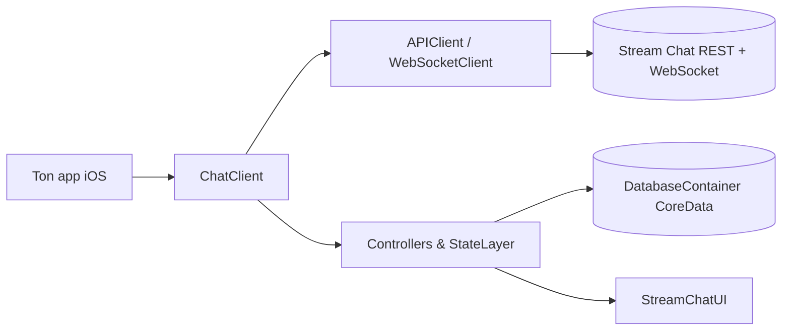

# GetStream/stream-chat-swift

> SDK iOS officiel de Stream Chat : client bas niveau et composants UIKit pour intégrer une messagerie dans une app.

## Le problème
Construire une messagerie temps réel (canaux, réactions, fils, hors ligne) sur iOS représente des mois de travail réseau, base locale et interface.

## Ce que ça fait vraiment
Fournit un client bas niveau (`StreamChat`) sans interface, et des composants UIKit (`StreamChatUI`) : liste de canaux, liste de messages, composeur, sondages, messages vocaux, commandes. Il parle à l'API REST et au WebSocket de Stream, persiste en CoreData et gère une file hors ligne. Le SDK SwiftUI vit dans un autre dépôt.

## Comment c'est branché

## Essayer
Le README ne documente pas de commande : l'installation passe par Swift Package Manager (Package.swift) ou CocoaPods, et il faut une clé d'API Stream.

## Coût et pièges
Il faut un compte Stream et une clé d'API ; gratuit sous cinq membres d'équipe et 10 000 $ de revenu mensuel, payant au-delà. Le backend est propriétaire : le SDK ne marche pas sans lui.

## Ce que ce n'est pas
Ce n'est pas un serveur de chat libre ni auto-hébergeable. La licence est « présente mais non identifiée » par GitHub. Les composants IA cités sont des interfaces, pas des modèles.

## Alternatives
- StreamChatSwiftUI : le SDK SwiftUI, dans un autre dépôt.

## Pour toi
À ignorer : un SDK mobile lié à un SaaS payant, sans rapport avec un profil data/IA/MLOps hormis les composants d'interface d'agents.

