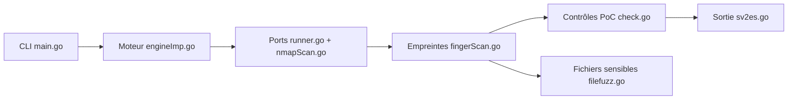

# GhostTroops/scan4all

> Scanner de sécurité Go qui enchaîne ports, empreintes web et contrôles de vulnérabilités, pour auditeurs autorisés.

## Le problème
Un audit de surface d'attaque oblige à enchaîner à la main plusieurs outils (découverte de ports, empreintes HTTP, modèles de vulnérabilités) puis à rassembler les résultats.

## Ce que ça fait vraiment
Il intègre des briques existantes (nuclei, subfinder, naabu, nmap, httpx) et des PoC maison. Le flux : découverte de ports, sondage et empreintes HTTP, contrôles web et vulnérabilités, audit de services par dictionnaire, puis rapport. Les résultats peuvent partir vers Elasticsearch. Plusieurs branches (smuggling, crawler, log4j) sont décrites au README, mais leur câblage n'a pas été vérifié dans le code.

## Comment c'est branché


## Essayer
```bash
go install github.com/GhostTroops/scan4all@2.8.9
scan4all -h
UrlPrecise=true ./scan4all -l xx.txt
```
À n'exécuter que sur des cibles dont vous avez l'autorisation écrite.

## Coût et pièges
Gratuit. Nmap à installer soi-même (mot de passe root passé par variable d'environnement), Elasticsearch optionnel via Docker. Le README mêle config et paramètres par variables d'environnement, peu structuré.

## Ce que ce n'est pas
Pas un produit maintenu activement : dernier push en juillet 2024. Pas un outil à lancer sans cadre légal : il inclut des tests d'identifiants. La liste « Work Plan » reste un projet, pas des fonctions livrées.

## Alternatives
- nuclei, subfinder, naabu, httpx : les briques d'origine, plus ciblées et suivies par leurs équipes.
- nmap seul : si seule la découverte de ports compte.

## Pour toi
Surveiller seulement : hors périmètre d'un profil data/IA/MLOps, et dépôt peu actif ; mieux vaut les briques d'origine si un audit autorisé est nécessaire.

