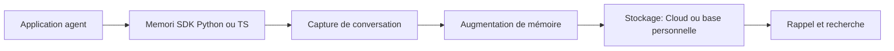

# GibsonAI/Memori

> SDK de mémoire pour agents : capture les échanges LLM, les structure et les rappelle plus tard.

## Le problème
Un agent oublie tout entre deux sessions et il faut répéter contexte et préférences.

## Ce que ça fait vraiment
Le SDK (Python et TypeScript) s'enregistre sur un client LLM ; les conversations, rattachées à une entité (l'utilisateur) et à un processus (l'agent), sont persistées puis rappelées automatiquement. Une augmentation en arrière-plan extrait faits, préférences, règles, compétences et relations. Plugins OpenClaw et Hermes, accès MCP pour Claude Code et Cursor, option de base de données personnelle.

## Comment c'est branché


## Essayer
```bash
pip install memori
python -m memori quota
claude mcp add --transport http memori https://api.memorilabs.ai/mcp/ --header "X-Memori-API-Key: ${MEMORI_API_KEY}"
```

## Coût et pièges
`MEMORI_API_KEY` requise ; l'augmentation avancée est gratuite pour les développeurs mais limitée sans compte. Sans attribution (entité et processus), aucune mémoire n'est créée. Une offre Enterprise existe.

## Ce que ce n'est pas
Ce n'est pas local par défaut : le mode Cloud envoie les conversations au service. Les chiffres de benchmark (LoCoMo) viennent de l'éditeur.

## Alternatives
- Zep, LangMem, Mem0 : systèmes de mémoire comparés par le README.

## Pour toi
À surveiller : mémoire d'agent simple à brancher, mais tes conversations transitent par un SaaS et la licence n'est pas déclarée.
