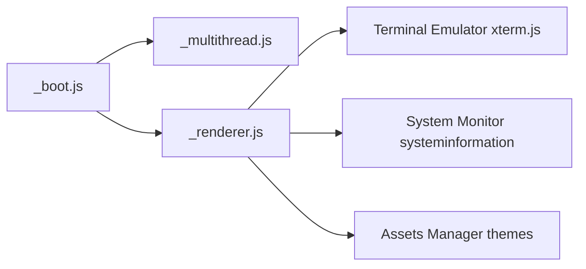

# GitSquared/edex-ui

> Émulateur de terminal plein écran au look science-fiction, avec moniteur système, pour amateurs.

## Le problème
Aucun vrai problème : c'est un terminal esthétique inspiré de TRON Legacy.

## Ce que ça fait vraiment
Terminal à onglets (xterm.js), supervision CPU/RAM/réseau en temps réel (systeminformation), explorateur qui suit le répertoire courant (sauf Windows), clavier tactile, thèmes et sons. Application Electron : `_boot.js` démarre, `_multithread.js` délègue, `_renderer.js` dessine.

## Comment c'est branché


## Essayer
```bash
npm run install-linux
npm run start
npm run build-linux
```

## Coût et pièges
Binaires non signés. Projet archivé depuis 2021 : aucune correction.

## Ce que ce n'est pas
Pas un terminal de travail maintenu ; l'auteur dit lui-même que c'est « peut-être une blague prise trop au sérieux ».

## Alternatives
Aucune nommée dans le README.

## Pour toi
Curiosité visuelle, sans intérêt data/IA : à ignorer.
