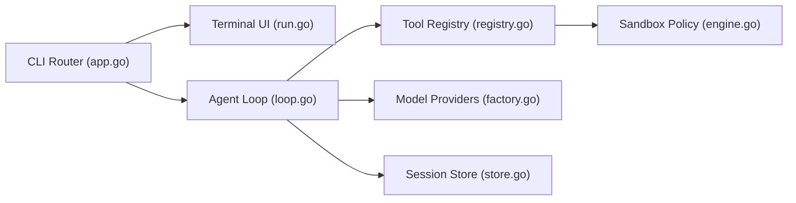

# Gitlawb/zero

> Agent de codage en terminal, multi-fournisseurs de modèles, avec permissions et sessions locales.

## Le problème
Les agents de code enferment dans un fournisseur et cachent leurs effets de bord.

## Ce que ça fait vraiment
Binaire Go avec interface TUI et mode `zero exec` scriptable (texte, JSON, stream-JSON, worktrees isolés). Boucle d'agent avec outils fichiers et shell, soumis à une politique de permissions et de sandbox. Fournisseurs : OpenAI, Anthropic, Gemini, Ollama, LM Studio et endpoints compatibles. Extensible par MCP, skills, plugins, hooks et sous-agents. Sessions stockées sur disque, sans télémétrie annoncée.

## Comment c'est branché


## Essayer
```bash
npm install -g @gitlawb/zero
zero
zero exec "fix the failing test in ./pkg"
zero doctor
```

## Coût et pièges
Clé du fournisseur à ta charge (ou modèle local). Compilation depuis les sources : Go 1.26.6+. Sur Linux, un helper de sandbox est à construire séparément. 86 issues ouvertes.

## Ce que ce n'est pas
Pas un produit éprouvé : le dépôt date de mai 2026 et le README mentionne encore des tests avant la première release publique. L'absence de télémétrie est déclarative.

## Alternatives
Aucune alternative nommée dans le README.

## Pour toi
À surveiller : agent de code ouvert intéressant si tu veux changer de modèle librement, mais trop jeune pour un usage critique.
